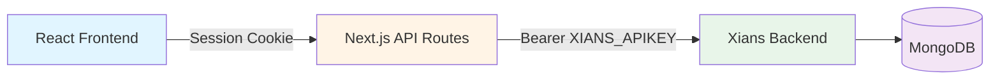
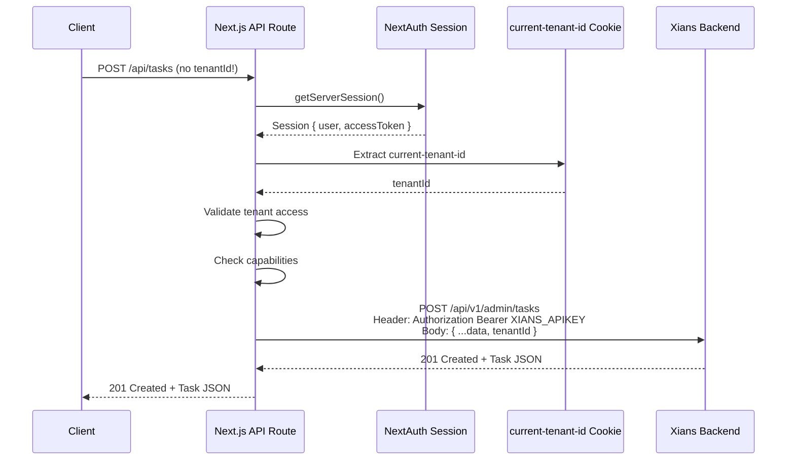
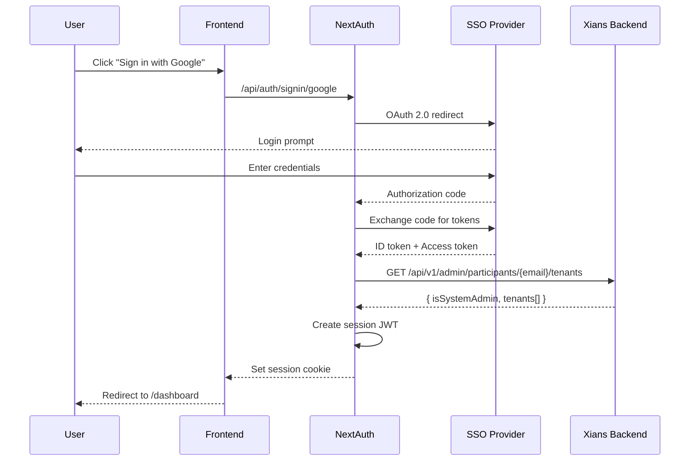
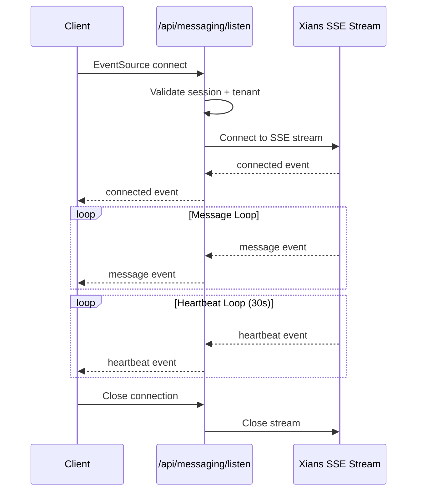

# REST API Contract

**Version:** 1.0  
**Last Updated:** 2026-07-16  
**Status:** Active

---

## Table of Contents

1. [Overview](#overview)
2. [API Architecture](#api-architecture)
3. [Authentication](#authentication)
4. [Authorization](#authorization)
5. [Common Patterns](#common-patterns)
6. [Error Handling](#error-handling)
7. [Rate Limiting](#rate-limiting)
8. [Endpoint Catalog](#endpoint-catalog)
9. [Real-Time APIs](#real-time-apis)
10. [Webhook APIs](#webhook-apis)

**Related Documents:**
- **[System Overview](./SYSTEM_OVERVIEW.md)** - BFF pattern architecture
- **[Data Model](./DATA_MODEL.md)** - Entity definitions
- **[Security Architecture](./SECURITY_ARCHITECTURE.md)** - Security controls
- **[Multi-Tenancy Architecture](./MULTI_TENANCY.md)** - Tenant isolation

---

## Overview

Agent Studio exposes a **Backend-for-Frontend (BFF) API** through Next.js API routes. The BFF acts as a trusted intermediary between the frontend and the Xians backend, handling authentication, authorization, and tenant scoping.

### API Characteristics

- **Protocol:** HTTP/1.1 and HTTP/2
- **Format:** JSON (request/response bodies)
- **Authentication:** Session-based (NextAuth.js cookies)
- **Authorization:** Capability-based (derived from tenant roles)
- **Tenant Context:** Resolved server-side from httpOnly cookie
- **Base URL:** `/api/*`
- **Backend Base URL:** `https://<xians-server>/api/v1/admin/*`

### API Layers



---

## API Architecture

### BFF Pattern

The BFF (Backend-for-Frontend) pattern provides:

1. **Trust Boundary:** Authentication and authorization enforced at API layer
2. **Tenant Injection:** Server-side resolution of tenant context (never from client)
3. **Data Transformation:** Backend responses mapped to frontend-friendly formats
4. **Security:** Sensitive credentials (XIANS_APIKEY) never exposed to client
5. **Error Handling:** Consistent error responses across all endpoints

### Request Flow



### Middleware Wrappers

All API routes use middleware wrappers for consistent auth/authz:

```typescript
// Tenant-scoped route (most common)
export const GET = withTenantFromSession(async (req, ctx) => {
  const { tenantId, session, tenantContext } = ctx
  // tenantId injected from cookie, validated by middleware
})

// Participant Admin route (settings, agent management)
export const POST = withParticipantAdmin(async (req, ctx) => {
  const { tenantId, session, tenantContext } = ctx
  // Requires 'settings:view' capability
})

// Tenant Admin route (user management)
export const PUT = withTenantAdmin(async (req, ctx) => {
  const { tenantId, session, tenantContext } = ctx
  // Requires 'users:manage' capability
})

// System Admin route (platform management)
export const DELETE = withSystemAdmin(async (req, ctx) => {
  const { session } = ctx
  // Requires 'system:admin' capability, no tenant context
})
```

---

## Authentication

### Session-Based Authentication

Agent Studio uses NextAuth.js for session management with SSO providers.

#### Login Flow



#### Session Cookie

**Name:** `next-auth.session-token` (production) or `next-auth.session-token` (development)

**Attributes:**
- `HttpOnly: true` - Not accessible to JavaScript
- `Secure: true` - HTTPS only (production)
- `SameSite: Lax` - CSRF protection
- `Path: /` - Available to all routes
- `Max-Age: 2592000` - 30 days

**Payload (JWT):**
```json
{
  "id": "user-123",
  "email": "user@example.com",
  "name": "John Doe",
  "picture": "https://example.com/avatar.jpg",
  "accessToken": "ya29.a0AfH6SMB...",
  "provider": "google",
  "hasTenantAccess": true,
  "isSystemAdmin": false,
  "iat": 1234567890,
  "exp": 1237159890
}
```

#### Tenant Context Cookie

**Name:** `current-tenant-id`

**Attributes:**
- `HttpOnly: true` - Not accessible to JavaScript (CRITICAL for security)
- `Secure: true` - HTTPS only (production)
- `SameSite: Strict` - Strict CSRF protection
- `Path: /api` - Only sent to API routes
- `Max-Age: 2592000` - 30 days

**Purpose:** 
- Stores selected tenant ID for API routes
- Set by `POST /api/user/current-tenant`
- Read by `withTenantFromSession` middleware
- NEVER sent from client in request body/query

---

## Authorization

### Capability-Based Authorization

Agent Studio uses a capability model derived from backend participant roles.

#### Capabilities

```typescript
type Capability =
  | 'agents:read'              // View agents
  | 'agents:write'             // Create/update agents
  | 'agents:activate'          // Activate/deactivate agents
  | 'conversations:read'       // View conversations
  | 'conversations:write'      // Send messages
  | 'tasks:read'               // View tasks
  | 'tasks:review'             // Approve/reject tasks
  | 'knowledge:read'           // View knowledge base
  | 'knowledge:write'          // Edit knowledge base
  | 'settings:view'            // Access settings pages
  | 'settings:manage'          // Edit settings
  | 'users:manage'             // Manage tenant users
  | 'system:admin'             // Platform administration
```

#### Role-to-Capability Mapping

| Backend Role | Frontend Capabilities | Access Level |
|--------------|----------------------|--------------|
| `TenantParticipant` | `conversations:read`, `conversations:write`, `tasks:read` | Conversation participant |
| `TenantParticipantAdmin` | + `agents:*`, `knowledge:*`, `settings:*`, `tasks:review` | Agent administrator |
| `TenantUser` | Same as TenantParticipantAdmin | Non-participant admin |
| `TenantAdmin` | + `users:manage` | Full tenant control |
| System Admin | `system:admin` + all others | Platform control |

#### Authorization Enforcement

```typescript
// Middleware checks capability before route execution
export const POST = withParticipantAdmin(async (req, ctx) => {
  // This route requires 'settings:view' capability
  // Middleware has already verified user has this capability
  // If not, returns 403 Forbidden before reaching this code
})

// Manual capability check (rare)
import { hasCapability } from '@/lib/auth/capabilities'

const capabilities = await getCapabilitiesFromSession(session, tenantId)
if (!hasCapability(capabilities, 'knowledge:write')) {
  return NextResponse.json({ error: 'Forbidden' }, { status: 403 })
}
```

---

## Common Patterns

### Request Headers

All API requests should include:

```http
Cookie: next-auth.session-token=eyJhbGciOiJIUzI1NiIsInR5cCI6IkpXVCJ9...; current-tenant-id=tenant-123
Content-Type: application/json
Accept: application/json
```

### Response Headers

All API responses include:

```http
Content-Type: application/json; charset=utf-8
Cache-Control: no-store, must-revalidate
X-Content-Type-Options: nosniff
X-Frame-Options: DENY
X-XSS-Protection: 1; mode=block
```

### Pagination

Paginated responses follow this structure:

```json
{
  "data": [...],
  "pagination": {
    "page": 1,
    "pageSize": 20,
    "totalPages": 5,
    "totalItems": 100,
    "hasNext": true,
    "hasPrevious": false
  }
}
```

**Query Parameters:**
- `page` - Page number (1-indexed)
- `pageSize` - Items per page (default: 20, max: 100)

**Example:**
```
GET /api/agents?page=2&pageSize=50
```

### Filtering

**Query Parameters:**
- `status` - Filter by status
- `category` - Filter by category
- `search` - Full-text search
- `from` - Date range start (ISO 8601)
- `to` - Date range end (ISO 8601)

**Example:**
```
GET /api/tasks?status=pending&priority=high&from=2026-01-01T00:00:00Z
```

### Sorting

**Query Parameters:**
- `sortBy` - Field to sort by
- `sortOrder` - `asc` or `desc`

**Example:**
```
GET /api/agents?sortBy=createdAt&sortOrder=desc
```

### Timestamps

All timestamps are in **ISO 8601 format** with UTC timezone:

```json
{
  "createdAt": "2026-07-16T14:32:15.123Z",
  "updatedAt": "2026-07-16T15:45:30.456Z"
}
```

---

## Error Handling

### Error Response Format

```json
{
  "error": "Human-readable error message",
  "code": "ERROR_CODE",
  "details": {
    "field": "email",
    "reason": "Invalid format"
  }
}
```

### HTTP Status Codes

| Code | Meaning | Usage |
|------|---------|-------|
| 200 | OK | Successful GET/PUT request |
| 201 | Created | Successful POST request |
| 204 | No Content | Successful DELETE request |
| 400 | Bad Request | Invalid request body/parameters |
| 401 | Unauthorized | Missing or invalid session |
| 403 | Forbidden | Insufficient permissions |
| 404 | Not Found | Resource doesn't exist |
| 409 | Conflict | Resource already exists or concurrent update |
| 422 | Unprocessable Entity | Validation error |
| 429 | Too Many Requests | Rate limit exceeded |
| 500 | Internal Server Error | Unexpected server error |
| 502 | Bad Gateway | Backend service unavailable |
| 503 | Service Unavailable | Temporary service outage |

### Error Codes

| Code | HTTP Status | Description |
|------|-------------|-------------|
| `UNAUTHORIZED` | 401 | No valid session |
| `FORBIDDEN` | 403 | Insufficient permissions |
| `TENANT_NOT_FOUND` | 404 | Tenant doesn't exist or user has no access |
| `RESOURCE_NOT_FOUND` | 404 | Requested resource not found |
| `VALIDATION_ERROR` | 422 | Request validation failed |
| `TENANT_REQUIRED` | 400 | No tenant selected |
| `AGENT_NOT_FOUND` | 404 | Agent deployment not found |
| `ACTIVATION_NOT_FOUND` | 404 | Agent activation not found |
| `CONVERSATION_NOT_FOUND` | 404 | Conversation not found |
| `TASK_NOT_FOUND` | 404 | Task not found |
| `DUPLICATE_NAME` | 409 | Resource with this name already exists |
| `RATE_LIMIT_EXCEEDED` | 429 | Too many requests |
| `BACKEND_ERROR` | 502 | Xians backend error |
| `INTERNAL_ERROR` | 500 | Unexpected error |

### Example Error Responses

#### 400 Bad Request
```json
{
  "error": "Validation failed",
  "code": "VALIDATION_ERROR",
  "details": [
    {
      "field": "title",
      "message": "Title is required"
    },
    {
      "field": "priority",
      "message": "Priority must be one of: low, medium, high, urgent"
    }
  ]
}
```

#### 401 Unauthorized
```json
{
  "error": "Unauthorized",
  "code": "UNAUTHORIZED"
}
```

#### 403 Forbidden
```json
{
  "error": "Insufficient permissions to access this resource",
  "code": "FORBIDDEN",
  "details": {
    "required": "agents:write",
    "actual": ["agents:read", "conversations:read"]
  }
}
```

#### 404 Not Found
```json
{
  "error": "Agent deployment not found",
  "code": "AGENT_NOT_FOUND",
  "details": {
    "agentName": "support-agent"
  }
}
```

#### 409 Conflict
```json
{
  "error": "Agent activation with this name already exists",
  "code": "DUPLICATE_NAME",
  "details": {
    "name": "support-activation",
    "existingId": "activation-123"
  }
}
```

#### 429 Too Many Requests
```json
{
  "error": "Rate limit exceeded",
  "code": "RATE_LIMIT_EXCEEDED",
  "details": {
    "limit": 100,
    "window": "1m",
    "retryAfter": 45
  }
}
```

---

## Rate Limiting

### Rate Limits

| Endpoint Pattern | Limit | Window | Scope |
|------------------|-------|--------|-------|
| `/api/auth/*` | 10 requests | 1 minute | IP address |
| `/api/messaging/send` | 60 requests | 1 minute | User + Tenant |
| `/api/tasks` (POST) | 30 requests | 1 minute | User + Tenant |
| `/api/knowledge` (POST/PUT) | 20 requests | 1 minute | User + Tenant |
| `/api/agents` (GET) | 120 requests | 1 minute | User + Tenant |
| All other `/api/*` | 300 requests | 1 minute | User + Tenant |

### Rate Limit Headers

Responses include rate limit information:

```http
X-RateLimit-Limit: 60
X-RateLimit-Remaining: 45
X-RateLimit-Reset: 1657984830
```

### Rate Limit Exceeded Response

```json
{
  "error": "Rate limit exceeded",
  "code": "RATE_LIMIT_EXCEEDED",
  "details": {
    "limit": 60,
    "window": "1m",
    "retryAfter": 45
  }
}
```

**HTTP Status:** 429 Too Many Requests

**Retry-After Header:** Seconds until rate limit resets

```http
Retry-After: 45
```

---

## Endpoint Catalog

### Authentication Endpoints

#### POST /api/auth/signin/:provider

Sign in with SSO provider.

**Provider:** `google`, `azure-ad`, `keycloak`

**Request:**
```http
POST /api/auth/signin/google
```

**Response:** Redirect to SSO provider

---

#### POST /api/auth/signout

Sign out and clear session.

**Request:**
```http
POST /api/auth/signout
```

**Response:** Redirect to login page

---

#### GET /api/auth/session

Get current session.

**Request:**
```http
GET /api/auth/session
```

**Response:**
```json
{
  "user": {
    "id": "user-123",
    "email": "user@example.com",
    "name": "John Doe",
    "image": "https://example.com/avatar.jpg",
    "hasTenantAccess": true,
    "isSystemAdmin": false
  },
  "accessToken": "ya29.a0AfH6SMB...",
  "expires": "2026-08-15T14:32:15.123Z"
}
```

---

### User Endpoints

#### GET /api/user/tenants

List tenants accessible to current user.

**Authentication:** Required

**Request:**
```http
GET /api/user/tenants
```

**Response:**
```json
{
  "tenants": [
    {
      "tenant": {
        "id": "tenant-123",
        "name": "Acme Corp",
        "slug": "acme",
        "theme": "gaia",
        "metadata": {
          "logo": {
            "url": "https://example.com/logo.png",
            "width": 200,
            "height": 50
          }
        }
      },
      "role": "admin",
      "roleLabel": "Administrator",
      "capabilities": [
        "agents:read",
        "agents:write",
        "conversations:read",
        "settings:view"
      ]
    }
  ],
  "isSystemAdmin": false
}
```

---

#### POST /api/user/current-tenant

Set current tenant for session (sets `current-tenant-id` cookie).

**Authentication:** Required

**Request:**
```http
POST /api/user/current-tenant
Content-Type: application/json

{
  "tenantId": "tenant-123"
}
```

**Response:**
```json
{
  "success": true,
  "tenantId": "tenant-123"
}
```

**Side Effect:** Sets `current-tenant-id` httpOnly cookie

---

### Agent Endpoints

#### GET /api/agents

List agent deployments for current tenant.

**Authentication:** Required  
**Authorization:** `agents:read`  
**Tenant Context:** From cookie

**Query Parameters:**
- `page` (number) - Page number (default: 1)
- `pageSize` (number) - Items per page (default: 20, max: 100)
- `status` (string) - Filter by status: `active`, `inactive`, `suspended`
- `category` (string) - Filter by category
- `search` (string) - Search by name or description

**Request:**
```http
GET /api/agents?page=1&pageSize=20&status=active
```

**Response:**
```json
{
  "agents": [
    {
      "id": "agent-123",
      "tenant": "tenant-123",
      "name": "support-agent",
      "description": "Customer support agent",
      "summary": "Handles customer inquiries",
      "version": "1.0.0",
      "author": "Engineering Team",
      "category": "Support",
      "status": "active",
      "createdAt": "2026-01-15T10:30:00Z",
      "updatedAt": "2026-07-10T14:20:00Z",
      "createdBy": "user-123"
    }
  ],
  "pagination": {
    "page": 1,
    "pageSize": 20,
    "totalPages": 3,
    "totalItems": 45,
    "hasNext": true,
    "hasPrevious": false
  }
}
```

---

#### GET /api/agents/:agentName

Get agent deployment details.

**Authentication:** Required  
**Authorization:** `agents:read`  
**Tenant Context:** From cookie

**Request:**
```http
GET /api/agents/support-agent
```

**Response:**
```json
{
  "agent": {
    "id": "agent-123",
    "name": "support-agent",
    "tenant": "tenant-123",
    "description": "Customer support agent with ticket management",
    "summary": "Handles customer inquiries and creates tickets",
    "version": "1.2.0",
    "author": "Engineering Team",
    "category": "Support",
    "samplePrompts": [
      "I need help with my account",
      "Create a support ticket for billing issue"
    ],
    "createdAt": "2026-01-15T10:30:00Z",
    "updatedAt": "2026-07-10T14:20:00Z",
    "createdBy": "user-123"
  },
  "definitions": [
    {
      "id": "def-456",
      "workflowType": "SupportWorkflow",
      "name": "Support Agent Workflow",
      "hash": "abc123def456",
      "source": "...",
      "markdown": "# Support Agent\\n\\nHandles customer support...",
      "activityDefinitions": [...],
      "parameterDefinitions": [
        {
          "name": "ticketPriority",
          "type": "string",
          "description": "Default ticket priority",
          "optional": true
        }
      ],
      "activable": true,
      "summary": "Main support workflow"
    }
  ]
}
```

---

#### POST /api/agents

Create new agent deployment.

**Authentication:** Required  
**Authorization:** `agents:write`  
**Tenant Context:** From cookie (injected by BFF)

**Request:**
```http
POST /api/agents
Content-Type: application/json

{
  "name": "sales-agent",
  "description": "Sales assistant agent",
  "summary": "Helps with sales inquiries",
  "version": "1.0.0",
  "author": "Sales Team",
  "category": "Sales",
  "config": {
    "defaultLanguage": "en",
    "timezone": "America/New_York"
  }
}
```

**Response:**
```json
{
  "id": "agent-789",
  "tenant": "tenant-123",
  "name": "sales-agent",
  "description": "Sales assistant agent",
  "summary": "Helps with sales inquiries",
  "version": "1.0.0",
  "author": "Sales Team",
  "category": "Sales",
  "status": "inactive",
  "config": {
    "defaultLanguage": "en",
    "timezone": "America/New_York"
  },
  "createdAt": "2026-07-16T15:30:00Z",
  "createdBy": "user-123"
}
```

**Status:** 201 Created

---

#### PUT /api/agents/:agentName

Update agent deployment.

**Authentication:** Required  
**Authorization:** `agents:write`  
**Tenant Context:** From cookie

**Request:**
```http
PUT /api/agents/sales-agent
Content-Type: application/json

{
  "description": "Updated description",
  "status": "active"
}
```

**Response:**
```json
{
  "id": "agent-789",
  "tenant": "tenant-123",
  "name": "sales-agent",
  "description": "Updated description",
  "status": "active",
  "updatedAt": "2026-07-16T16:00:00Z"
}
```

---

#### DELETE /api/agents/:agentName

Delete agent deployment (soft delete - marks as inactive).

**Authentication:** Required  
**Authorization:** `agents:write`  
**Tenant Context:** From cookie

**Request:**
```http
DELETE /api/agents/sales-agent
```

**Response:**
```json
{
  "success": true,
  "message": "Agent deployment deleted"
}
```

**Status:** 204 No Content

---

### Agent Activation Endpoints

#### GET /api/agent-activations

List agent activations for current tenant.

**Authentication:** Required  
**Authorization:** `agents:read`  
**Tenant Context:** From cookie

**Query Parameters:**
- `agentName` (string) - Filter by agent name
- `isActive` (boolean) - Filter by active status
- `participantId` (string) - Filter by participant

**Request:**
```http
GET /api/agent-activations?agentName=support-agent&isActive=true
```

**Response:**
```json
{
  "activations": [
    {
      "id": "activation-123",
      "tenantId": "tenant-123",
      "name": "support-activation-1",
      "agentName": "support-agent",
      "description": "Primary support activation",
      "participantId": "participant-456",
      "isActive": true,
      "activatedAt": "2026-07-01T10:00:00Z",
      "workflowIds": ["workflow-789"],
      "workflowConfiguration": {
        "workflows": [
          {
            "workflowType": "SupportWorkflow",
            "inputs": [
              {
                "name": "ticketPriority",
                "value": "medium"
              }
            ]
          }
        ]
      },
      "createdAt": "2026-07-01T09:45:00Z",
      "createdBy": "user-123"
    }
  ],
  "pagination": {
    "page": 1,
    "pageSize": 20,
    "totalPages": 1,
    "totalItems": 3,
    "hasNext": false,
    "hasPrevious": false
  }
}
```

---

#### POST /api/agent-activations

Create new agent activation.

**Authentication:** Required  
**Authorization:** `agents:activate`  
**Tenant Context:** From cookie

**Request:**
```http
POST /api/agent-activations
Content-Type: application/json

{
  "name": "support-activation-2",
  "agentName": "support-agent",
  "description": "Secondary support activation",
  "participantId": "participant-789",
  "workflowConfiguration": {
    "workflows": [
      {
        "workflowType": "SupportWorkflow",
        "inputs": [
          {
            "name": "ticketPriority",
            "value": "high"
          }
        ]
      }
    ]
  }
}
```

**Response:**
```json
{
  "id": "activation-456",
  "tenantId": "tenant-123",
  "name": "support-activation-2",
  "agentName": "support-agent",
  "description": "Secondary support activation",
  "participantId": "participant-789",
  "isActive": false,
  "workflowConfiguration": {
    "workflows": [
      {
        "workflowType": "SupportWorkflow",
        "inputs": [
          {
            "name": "ticketPriority",
            "value": "high"
          }
        ]
      }
    ]
  },
  "createdAt": "2026-07-16T15:30:00Z",
  "createdBy": "user-123"
}
```

**Status:** 201 Created

---

#### POST /api/agent-activations/:activationName/activate

Activate an agent activation.

**Authentication:** Required  
**Authorization:** `agents:activate`  
**Tenant Context:** From cookie

**Request:**
```http
POST /api/agent-activations/support-activation-2/activate
```

**Response:**
```json
{
  "id": "activation-456",
  "isActive": true,
  "activatedAt": "2026-07-16T16:00:00Z",
  "workflowIds": ["workflow-999"]
}
```

---

#### POST /api/agent-activations/:activationName/deactivate

Deactivate an agent activation.

**Authentication:** Required  
**Authorization:** `agents:activate`  
**Tenant Context:** From cookie

**Request:**
```http
POST /api/agent-activations/support-activation-2/deactivate
```

**Response:**
```json
{
  "id": "activation-456",
  "isActive": false,
  "deactivatedAt": "2026-07-16T17:00:00Z"
}
```

---

### Messaging Endpoints

#### GET /api/messaging/topics

List conversation topics for an agent activation.

**Authentication:** Required  
**Authorization:** `conversations:read`  
**Tenant Context:** From cookie

**Query Parameters:**
- `agentName` (string, required) - Agent name
- `activationName` (string, required) - Activation name
- `participantId` (string, required) - Participant ID
- `page` (number) - Page number
- `pageSize` (number) - Items per page

**Request:**
```http
GET /api/messaging/topics?agentName=support-agent&activationName=support-activation-1&participantId=participant-456
```

**Response:**
```json
{
  "topics": [
    {
      "scope": null,
      "lastMessageAt": "2026-07-16T14:30:00Z",
      "messageCount": 25
    },
    {
      "scope": "billing-issue",
      "lastMessageAt": "2026-07-15T10:15:00Z",
      "messageCount": 8
    }
  ],
  "pagination": {
    "page": 1,
    "pageSize": 20,
    "total": 2,
    "hasMore": false
  }
}
```

---

#### GET /api/messaging/history

Get message history for a conversation topic.

**Authentication:** Required  
**Authorization:** `conversations:read`  
**Tenant Context:** From cookie

**Query Parameters:**
- `agentName` (string, required) - Agent name
- `activationName` (string, required) - Activation name
- `participantId` (string, required) - Participant ID
- `scope` (string, optional) - Topic scope (null = default topic)
- `limit` (number) - Max messages to return (default: 50, max: 100)
- `before` (string) - Message ID cursor for pagination

**Request:**
```http
GET /api/messaging/history?agentName=support-agent&activationName=support-activation-1&participantId=participant-456&scope=billing-issue&limit=20
```

**Response:**
```json
[
  {
    "id": "msg-123",
    "threadId": "thread-456",
    "requestId": "req-789",
    "tenantId": "tenant-123",
    "createdAt": "2026-07-16T14:30:00Z",
    "updatedAt": "2026-07-16T14:30:00Z",
    "createdBy": "participant-456",
    "direction": "Incoming",
    "text": "I have a question about my billing",
    "status": "delivered",
    "data": null,
    "participantId": "participant-456",
    "scope": "billing-issue",
    "hint": null,
    "taskId": null,
    "workflowId": "workflow-789",
    "workflowType": "SupportWorkflow",
    "messageType": "Chat",
    "origin": "web",
    "feedback": null
  },
  {
    "id": "msg-124",
    "threadId": "thread-456",
    "direction": "Outgoing",
    "text": "I'd be happy to help you with your billing question. What specific issue are you experiencing?",
    "createdAt": "2026-07-16T14:30:05Z",
    "createdBy": "support-agent",
    "participantId": "participant-456",
    "scope": "billing-issue",
    "workflowId": "workflow-789",
    "workflowType": "SupportWorkflow",
    "messageType": "Chat"
  }
]
```

---

#### POST /api/messaging/send

Send a message to an agent activation.

**Authentication:** Required  
**Authorization:** `conversations:write`  
**Tenant Context:** From cookie

**Request:**
```http
POST /api/messaging/send
Content-Type: application/json

{
  "agentName": "support-agent",
  "activationName": "support-activation-1",
  "participantId": "participant-456",
  "text": "I was charged twice for my subscription",
  "topic": "billing-issue",
  "type": 0
}
```

**Response:**
```json
{
  "id": "msg-125",
  "threadId": "thread-456",
  "requestId": "req-890",
  "createdAt": "2026-07-16T14:35:00Z",
  "status": "sent"
}
```

**Status:** 201 Created

---

#### GET /api/messaging/listen (SSE)

Server-Sent Events stream for real-time messages.

**Authentication:** Required  
**Authorization:** `conversations:read`  
**Tenant Context:** From cookie

**Query Parameters:**
- `agentName` (string, required) - Agent name
- `activationName` (string, required) - Activation name
- `participantId` (string, required) - Participant ID
- `heartbeatSeconds` (number) - Heartbeat interval (default: 30)

**Request:**
```http
GET /api/messaging/listen?agentName=support-agent&activationName=support-activation-1&participantId=participant-456
Accept: text/event-stream
```

**Response Stream:**
```
event: connected
data: {"timestamp":"2026-07-16T14:40:00Z"}

event: message
data: {"id":"msg-126","threadId":"thread-456","text":"Your issue has been escalated...","createdAt":"2026-07-16T14:40:15Z",...}

event: heartbeat
data: {"timestamp":"2026-07-16T14:40:30Z"}

event: message
data: {"id":"msg-127","threadId":"thread-456","text":"A billing specialist will contact you...","createdAt":"2026-07-16T14:41:00Z",...}
```

**Content-Type:** `text/event-stream`

---

### Task Endpoints

#### GET /api/tasks

List tasks for current tenant.

**Authentication:** Required  
**Authorization:** `tasks:read`  
**Tenant Context:** From cookie

**Query Parameters:**
- `status` (string) - Filter by status: `pending`, `approved`, `rejected`, `obsolete`
- `priority` (string) - Filter by priority: `low`, `medium`, `high`, `urgent`
- `assignedTo` (string) - Filter by assignee user ID
- `from` (string) - Date range start (ISO 8601)
- `to` (string) - Date range end (ISO 8601)
- `page` (number) - Page number
- `pageSize` (number) - Items per page

**Request:**
```http
GET /api/tasks?status=pending&priority=high&page=1&pageSize=20
```

**Response:**
```json
{
  "tasks": [
    {
      "id": "task-123",
      "title": "Approve refund request",
      "description": "Customer requesting refund for duplicate charge",
      "status": "pending",
      "priority": "high",
      "createdBy": {
        "id": "support-agent",
        "name": "Support Agent"
      },
      "assignedTo": {
        "id": "user-123",
        "name": "John Doe"
      },
      "dueDate": "2026-07-17T12:00:00Z",
      "createdAt": "2026-07-16T14:30:00Z",
      "updatedAt": "2026-07-16T14:30:00Z",
      "conversationId": "thread-456",
      "topicId": "billing-issue",
      "content": {
        "originalRequest": "Customer was charged twice",
        "proposedAction": "Issue full refund for duplicate charge",
        "reasoning": "Duplicate transaction confirmed in billing system",
        "data": {
          "transactionId": "txn-789",
          "amount": 49.99,
          "currency": "USD"
        }
      }
    }
  ],
  "pagination": {
    "page": 1,
    "pageSize": 20,
    "totalPages": 2,
    "totalItems": 35,
    "hasNext": true,
    "hasPrevious": false
  }
}
```

---

#### POST /api/tasks/:taskId/approve

Approve a task.

**Authentication:** Required  
**Authorization:** `tasks:review`  
**Tenant Context:** From cookie

**Request:**
```http
POST /api/tasks/task-123/approve
Content-Type: application/json

{
  "comment": "Approved - duplicate charge confirmed"
}
```

**Response:**
```json
{
  "id": "task-123",
  "status": "approved",
  "updatedAt": "2026-07-16T15:00:00Z",
  "reviewedBy": {
    "id": "user-123",
    "name": "John Doe"
  },
  "reviewComment": "Approved - duplicate charge confirmed"
}
```

---

#### POST /api/tasks/:taskId/reject

Reject a task.

**Authentication:** Required  
**Authorization:** `tasks:review`  
**Tenant Context:** From cookie

**Request:**
```http
POST /api/tasks/task-123/reject
Content-Type: application/json

{
  "comment": "Insufficient documentation - need transaction receipts"
}
```

**Response:**
```json
{
  "id": "task-123",
  "status": "rejected",
  "updatedAt": "2026-07-16T15:00:00Z",
  "reviewedBy": {
    "id": "user-123",
    "name": "John Doe"
  },
  "reviewComment": "Insufficient documentation - need transaction receipts"
}
```

---

### Knowledge Endpoints

#### GET /api/knowledge

List knowledge articles for current tenant.

**Authentication:** Required  
**Authorization:** `knowledge:read`  
**Tenant Context:** From cookie

**Query Parameters:**
- `status` (string) - Filter by status: `draft`, `published`, `archived`
- `category` (string) - Filter by category
- `search` (string) - Full-text search
- `page` (number) - Page number
- `pageSize` (number) - Items per page

**Request:**
```http
GET /api/knowledge?status=published&category=billing&search=refund
```

**Response:**
```json
{
  "articles": [
    {
      "id": "kb-123",
      "tenantId": "tenant-123",
      "title": "Refund Policy",
      "content": "# Refund Policy\n\nOur refund policy allows...",
      "summary": "Overview of refund eligibility and process",
      "category": "billing",
      "tags": ["refund", "billing", "policy"],
      "status": "published",
      "version": 3,
      "createdBy": {
        "id": "user-123",
        "name": "John Doe"
      },
      "updatedBy": {
        "id": "user-456",
        "name": "Jane Smith"
      },
      "createdAt": "2026-01-10T09:00:00Z",
      "updatedAt": "2026-07-15T14:30:00Z"
    }
  ],
  "pagination": {
    "page": 1,
    "pageSize": 20,
    "totalPages": 1,
    "totalItems": 5,
    "hasNext": false,
    "hasPrevious": false
  }
}
```

---

#### GET /api/knowledge/:articleId

Get knowledge article details.

**Authentication:** Required  
**Authorization:** `knowledge:read`  
**Tenant Context:** From cookie

**Request:**
```http
GET /api/knowledge/kb-123
```

**Response:**
```json
{
  "id": "kb-123",
  "tenantId": "tenant-123",
  "title": "Refund Policy",
  "content": "# Refund Policy\n\nOur refund policy allows customers to...",
  "summary": "Overview of refund eligibility and process",
  "category": "billing",
  "tags": ["refund", "billing", "policy"],
  "status": "published",
  "version": 3,
  "createdBy": {
    "id": "user-123",
    "name": "John Doe"
  },
  "updatedBy": {
    "id": "user-456",
    "name": "Jane Smith"
  },
  "createdAt": "2026-01-10T09:00:00Z",
  "updatedAt": "2026-07-15T14:30:00Z",
  "versions": [
    {
      "id": "ver-1",
      "version": 1,
      "content": "# Refund Policy\n\nOriginal version...",
      "createdBy": "user-123",
      "createdAt": "2026-01-10T09:00:00Z",
      "changeNote": "Initial version"
    },
    {
      "id": "ver-2",
      "version": 2,
      "content": "# Refund Policy\n\nUpdated version...",
      "createdBy": "user-123",
      "createdAt": "2026-03-15T11:30:00Z",
      "changeNote": "Added international policy"
    }
  ]
}
```

---

#### POST /api/knowledge

Create new knowledge article.

**Authentication:** Required  
**Authorization:** `knowledge:write`  
**Tenant Context:** From cookie

**Request:**
```http
POST /api/knowledge
Content-Type: application/json

{
  "title": "Password Reset Guide",
  "content": "# Password Reset\n\nTo reset your password...",
  "summary": "Step-by-step password reset instructions",
  "category": "account",
  "tags": ["password", "security", "account"],
  "status": "draft"
}
```

**Response:**
```json
{
  "id": "kb-456",
  "tenantId": "tenant-123",
  "title": "Password Reset Guide",
  "content": "# Password Reset\n\nTo reset your password...",
  "summary": "Step-by-step password reset instructions",
  "category": "account",
  "tags": ["password", "security", "account"],
  "status": "draft",
  "version": 1,
  "createdBy": {
    "id": "user-123",
    "name": "John Doe"
  },
  "createdAt": "2026-07-16T15:30:00Z",
  "updatedAt": "2026-07-16T15:30:00Z"
}
```

**Status:** 201 Created

---

#### PUT /api/knowledge/:articleId

Update knowledge article.

**Authentication:** Required  
**Authorization:** `knowledge:write`  
**Tenant Context:** From cookie

**Request:**
```http
PUT /api/knowledge/kb-456
Content-Type: application/json

{
  "content": "# Password Reset\n\nUpdated content...",
  "status": "published",
  "changeNote": "Added troubleshooting section"
}
```

**Response:**
```json
{
  "id": "kb-456",
  "tenantId": "tenant-123",
  "title": "Password Reset Guide",
  "content": "# Password Reset\n\nUpdated content...",
  "status": "published",
  "version": 2,
  "updatedBy": {
    "id": "user-123",
    "name": "John Doe"
  },
  "updatedAt": "2026-07-16T16:00:00Z"
}
```

---

### Settings Endpoints

#### GET /api/can-access-settings

Check if user can access settings pages.

**Authentication:** Required  
**Tenant Context:** From cookie

**Request:**
```http
GET /api/can-access-settings
```

**Response:**
```json
{
  "canAccess": true,
  "capabilities": [
    "settings:view",
    "settings:manage"
  ]
}
```

---

#### GET /api/settings/branding

Get tenant branding settings.

**Authentication:** Required  
**Authorization:** `settings:view`  
**Tenant Context:** From cookie

**Request:**
```http
GET /api/settings/branding
```

**Response:**
```json
{
  "theme": "gaia",
  "logo": {
    "url": "https://example.com/logo.png",
    "imgBase64": null,
    "width": 200,
    "height": 50
  },
  "primaryColor": "#0066cc",
  "brandName": "Acme Corp"
}
```

---

#### PUT /api/settings/branding

Update tenant branding settings.

**Authentication:** Required  
**Authorization:** `settings:manage`  
**Tenant Context:** From cookie

**Request:**
```http
PUT /api/settings/branding
Content-Type: application/json

{
  "theme": "zenith",
  "primaryColor": "#008080"
}
```

**Response:**
```json
{
  "theme": "zenith",
  "primaryColor": "#008080",
  "updatedAt": "2026-07-16T16:00:00Z"
}
```

---

### System Admin Endpoints

#### GET /api/system-admin/tenants

List all tenants (system admin only).

**Authentication:** Required  
**Authorization:** `system:admin`

**Query Parameters:**
- `page` (number) - Page number
- `pageSize` (number) - Items per page
- `enabled` (boolean) - Filter by enabled status

**Request:**
```http
GET /api/system-admin/tenants?page=1&pageSize=50&enabled=true
```

**Response:**
```json
{
  "tenants": [
    {
      "id": "tenant-123",
      "tenantId": "tenant-123",
      "name": "Acme Corp",
      "domain": "acme.com",
      "description": "Enterprise customer",
      "theme": "gaia",
      "timezone": "America/New_York",
      "enabled": true,
      "createdAt": "2025-12-01T10:00:00Z",
      "createdBy": "admin-user",
      "updatedAt": "2026-07-10T14:00:00Z"
    }
  ],
  "pagination": {
    "page": 1,
    "pageSize": 50,
    "totalPages": 10,
    "totalItems": 478,
    "hasNext": true,
    "hasPrevious": false
  }
}
```

---

#### GET /api/system-admin/summary

Get platform summary statistics (system admin only).

**Authentication:** Required  
**Authorization:** `system:admin`

**Request:**
```http
GET /api/system-admin/summary
```

**Response:**
```json
{
  "tenants": {
    "total": 478,
    "enabled": 452,
    "disabled": 26
  },
  "users": {
    "total": 12543,
    "active": 11987,
    "inactive": 556
  },
  "agents": {
    "total": 1256,
    "active": 1102,
    "inactive": 154
  },
  "tasks": {
    "pending": 523,
    "approved": 45821,
    "rejected": 1234
  },
  "messages": {
    "last24h": 156234,
    "last7d": 987654
  }
}
```

---

## Real-Time APIs

### Server-Sent Events (SSE)

Agent Studio uses SSE for real-time message streaming.

#### Connection Lifecycle



#### Event Types

**Connected Event:**
```
event: connected
data: {"timestamp":"2026-07-16T14:40:00Z"}
```

**Message Event:**
```
event: message
data: {"id":"msg-126","threadId":"thread-456","text":"Hello","createdAt":"2026-07-16T14:40:15Z",...}
```

**Heartbeat Event:**
```
event: heartbeat
data: {"timestamp":"2026-07-16T14:40:30Z"}
```

#### Reconnection

Clients should implement exponential backoff for reconnection:

```typescript
let retryDelay = 1000 // 1 second
const maxRetryDelay = 30000 // 30 seconds

function connect() {
  const eventSource = new EventSource('/api/messaging/listen?...')
  
  eventSource.onerror = () => {
    eventSource.close()
    setTimeout(() => {
      connect()
      retryDelay = Math.min(retryDelay * 2, maxRetryDelay)
    }, retryDelay)
  }
  
  eventSource.onopen = () => {
    retryDelay = 1000 // Reset on successful connection
  }
}
```

---

## Webhook APIs

### Incoming Webhooks

#### POST /api/webhooks

Receive webhook events from external services.

**Authentication:** API Key (X-Webhook-Secret header)

**Request:**
```http
POST /api/webhooks
Content-Type: application/json
X-Webhook-Secret: webhook-secret-key

{
  "event": "payment.succeeded",
  "data": {
    "transactionId": "txn-123",
    "amount": 49.99,
    "currency": "USD"
  },
  "timestamp": "2026-07-16T14:30:00Z"
}
```

**Response:**
```json
{
  "received": true,
  "eventId": "evt-789"
}
```

**Status:** 200 OK

---

## Best Practices

### API Client Implementation

1. **Session Management:** Include session cookie in all requests
2. **Error Handling:** Handle 401/403 with redirect to login
3. **Retry Logic:** Implement exponential backoff for 5xx errors
4. **Rate Limiting:** Respect rate limit headers, back off on 429
5. **Timeouts:** Set reasonable timeouts (10s for reads, 30s for writes)
6. **Tenant Context:** Never send tenantId from client (security!)

### Performance Optimization

1. **Caching:** Cache tenant list, agent list (stale-while-revalidate)
2. **Pagination:** Always paginate large lists
3. **Lazy Loading:** Load conversation history on-demand
4. **Optimistic Updates:** Update UI before confirmation
5. **SSE for Real-Time:** Use SSE instead of polling for messages

### Security

1. **HTTPS Only:** All API calls must use HTTPS in production
2. **Cookie Security:** Session cookies are httpOnly, secure, sameSite
3. **Input Validation:** Validate all inputs client-side and server-side
4. **CSRF Protection:** SameSite cookies + double-submit pattern
5. **XSS Prevention:** Sanitize user-generated content before rendering

---

## Related Documentation

- **[Data Model](./DATA_MODEL.md)** - Entity definitions and relationships
- **[Security Architecture](./SECURITY_ARCHITECTURE.md)** - Security controls and threat model
- **[Multi-Tenancy Architecture](./MULTI_TENANCY.md)** - Tenant isolation implementation
- **[System Overview](./SYSTEM_OVERVIEW.md)** - High-level architecture

---

**Document Version:** 1.0  
**Last Updated:** 2026-07-16  
**Maintained By:** Agent Studio Engineering Team
