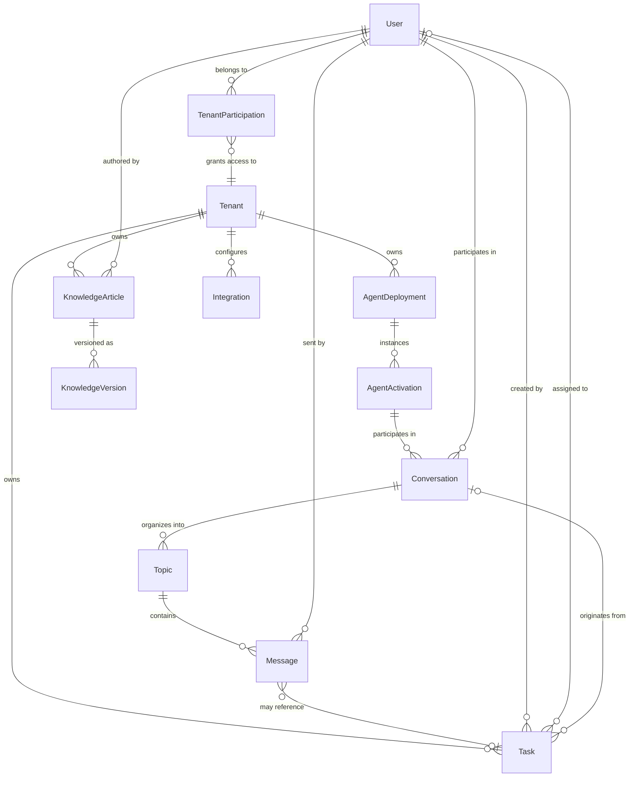
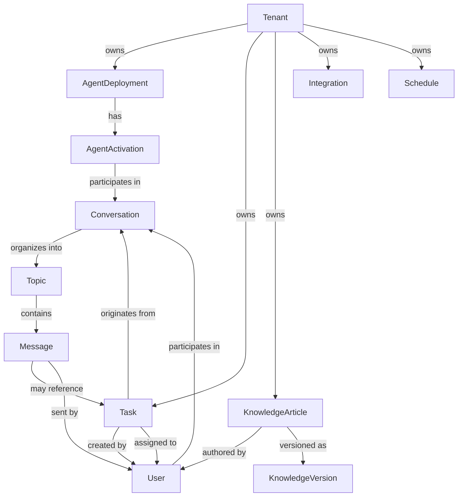
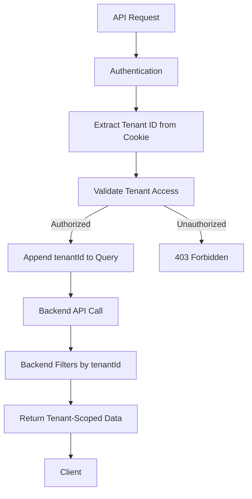
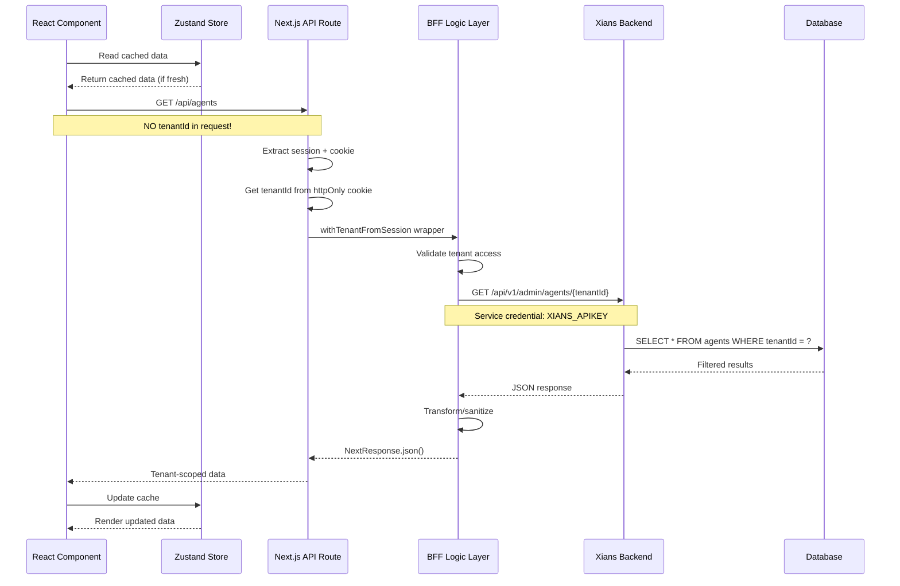
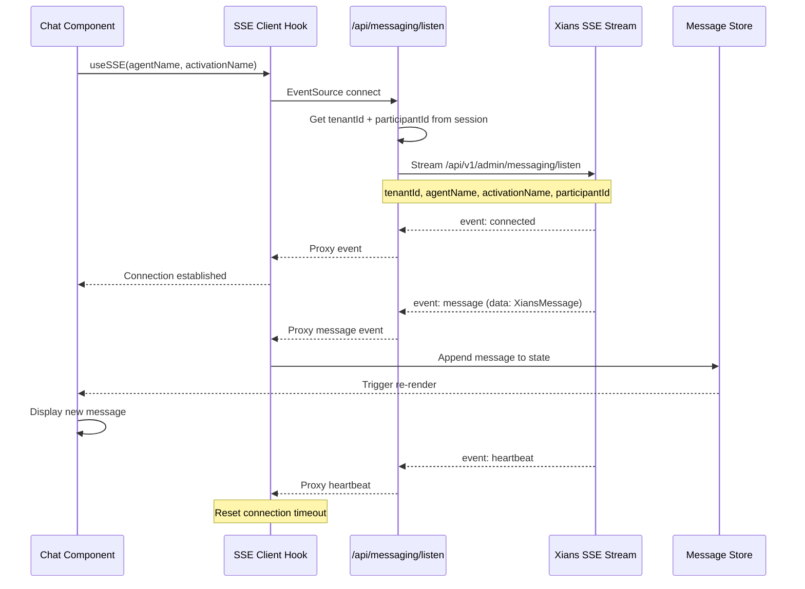

# Data Model & Entity Relationships

**Version:** 1.0  
**Last Updated:** 2026-07-16  
**Status:** Active

---

## Table of Contents

1. [Overview](#overview)
2. [Entity Relationship Overview](#entity-relationship-overview)
3. [Core Entities](#core-entities)
4. [Entity Relationships](#entity-relationships)
5. [Data Ownership Model](#data-ownership-model)
6. [Data Flow Architecture](#data-flow-architecture)
7. [State Management Patterns](#state-management-patterns)
8. [TypeScript Interfaces](#typescript-interfaces)
9. [Data Validation](#data-validation)
10. [Migration and Versioning](#migration-and-versioning)

**Related Documents:**
- **[System Overview](./SYSTEM_OVERVIEW.md)** - Overall architecture
- **[Multi-Tenancy Architecture](./MULTI_TENANCY.md)** - Tenant isolation model
- **[API Contract](./API_CONTRACT.md)** - REST API specification
- **[Security Architecture](./SECURITY_ARCHITECTURE.md)** - Security controls

---

## Overview

Agent Studio's data model is designed around **multi-tenant isolation**, **event-driven real-time updates**, and **hierarchical entity relationships**. The model enforces strict tenant boundaries while supporting flexible agent configurations and conversation management.

### Data Model Characteristics

- **Tenant-Scoped:** All operational data belongs to a specific tenant
- **Hierarchical:** Clear parent-child relationships (Tenant → Agent → Activation → Conversation → Topic → Message)
- **Event-Driven:** Real-time updates via Server-Sent Events (SSE)
- **Immutable History:** Message and task history retained for audit
- **Capability-Based Access:** Authorization determined by user capabilities within tenant

### Key Principles

1. **Tenant Isolation:** Every entity (except User and System-level data) has a `tenantId`
2. **Referential Integrity:** Parent entities must exist before children
3. **Audit Trail:** All mutations tracked with creator/timestamp metadata
4. **Eventual Consistency:** Frontend state may lag behind backend during real-time updates
5. **Fail Secure:** Missing or invalid relationships result in access denial

---

## Entity Relationship Overview

### High-Level Entity Model



### Entity Hierarchy

```
Platform (System-Wide)
├── User (SSO Identity)
├── SystemAdmin (Role)
└── Tenant
    ├── TenantParticipation (User ↔ Tenant membership)
    │   ├── Role (TenantAdmin, TenantParticipantAdmin, TenantParticipant, TenantUser)
    │   └── Capabilities (derived from role)
    │
    ├── AgentDeployment (tenant-specific agent instance)
    │   ├── AgentDefinition (workflow definitions)
    │   └── AgentActivation (running agent instance)
    │       └── Conversation (user ↔ agent interaction)
    │           └── Topic (conversation thread)
    │               └── Message (individual message)
    │                   ├── Attachment
    │                   ├── ContentDraft
    │                   └── Feedback
    │
    ├── Task (work items)
    │   ├── Status (pending, approved, rejected, obsolete)
    │   ├── Priority (low, medium, high, urgent)
    │   └── Assignment
    │
    ├── KnowledgeArticle (tenant knowledge base)
    │   ├── KnowledgeVersion (revision history)
    │   └── KnowledgeTag
    │
    ├── Integration (external connections)
    │   ├── ConnectionType
    │   └── ConnectionConfig
    │
    └── Schedule (recurring tasks)
        └── ScheduleHistory (execution log)
```

---

## Core Entities

### 1. User

**Purpose:** Represents an authenticated user identity (SSO provider account).

**Scope:** Platform-wide (not tenant-specific)

**Key Attributes:**
- `id` - Unique identifier (from SSO provider)
- `email` - Primary identifier for backend API calls
- `name` - Display name
- `image` - Avatar URL (optional)
- `hasTenantAccess` - Boolean flag indicating tenant membership
- `isSystemAdmin` - Platform administrator flag

**Relationships:**
- One user can have multiple tenant participations
- One user can participate in multiple conversations
- One user can create/be assigned to tasks

**Storage:**
- Session: NextAuth JWT token + database session
- Frontend: Zustand store (session context)

**TypeScript Interface:**
```typescript
// Augmented NextAuth types
interface Session {
  user: {
    id: string
    email: string
    name?: string | null
    image?: string | null
    hasTenantAccess?: boolean
    isSystemAdmin?: boolean
  }
  accessToken?: string
}
```

---

### 2. Tenant

**Purpose:** Represents an organization (customer) with isolated data and resources.

**Scope:** Platform-wide registry, data isolation per tenant

**Key Attributes:**
- `id` (tenantId) - Unique identifier (UUID or slug)
- `name` - Display name
- `slug` - URL-safe identifier
- `theme` - UI theme preference (optional)
- `logo` - Branding (base64 or URL)
- `enabled` - Whether tenant can access the platform
- `metadata` - Flexible key-value storage

**Relationships:**
- One tenant has many users (via TenantParticipation)
- One tenant owns many agents, tasks, conversations, knowledge articles

**Storage:**
- Backend: Xians database (primary source)
- Frontend: Zustand store (cached list)
- Cookie: `current-tenant-id` (httpOnly, server-side only)

**TypeScript Interface:**
```typescript
export interface Tenant {
  id: string                    // tenantId
  name: string
  slug: string
  theme?: ColorThemeId          // 'gaia' | 'zenith' | 'fjord' | 'skog'
  metadata?: {
    logo?: {
      url?: string | null
      imgBase64?: string | null
      width?: number
      height?: number
    }
    [key: string]: any
  }
}

export interface TenantContext {
  tenant: Tenant
  userRole: 'owner' | 'admin' | 'member' | 'viewer'
  permissions: string[]
}
```

**Backend Contract (Xians API):**
```typescript
export interface XiansTenant {
  tenantId: string
  name: string
  theme?: string
  logo?: {
    url?: string | null
    imgBase64?: string | null
    width?: number
    height?: number
  }
}

export interface XiansAdminTenant {
  id: string
  tenantId: string
  name: string
  domain?: string | null
  description?: string | null
  theme?: string | null
  timezone?: string | null
  enabled: boolean
  createdAt?: string
  createdBy?: string
  updatedAt?: string | null
}
```

---

### 3. TenantParticipation

**Purpose:** Junction entity linking users to tenants with role assignment.

**Scope:** Cross-tenant (managed by backend)

**Key Attributes:**
- `userId` - User identifier
- `tenantId` - Tenant identifier
- `role` - Backend role (TenantAdmin, TenantParticipantAdmin, TenantParticipant, TenantUser)
- `isApproved` - Whether participation is active
- `capabilities` - Derived frontend capabilities

**Relationships:**
- Many-to-many: User ↔ Tenant

**Backend Roles:**
```typescript
export type XiansParticipantRole =
  | 'TenantParticipant'        // Regular user
  | 'TenantParticipantAdmin'   // Can manage agents/settings
  | 'TenantAdmin'              // Can manage users
  | 'TenantUser'               // Non-participant admin role
```

**Capability Mapping:**
```typescript
export type Capability =
  | 'agents:read'              // View agents
  | 'agents:write'             // Create/update agents
  | 'agents:activate'          // Activate/deactivate agents
  | 'conversations:read'       // View conversations
  | 'conversations:write'      // Send messages
  | 'tasks:read'               // View tasks
  | 'tasks:review'             // Approve/reject tasks
  | 'knowledge:read'           // View knowledge base
  | 'knowledge:write'          // Edit knowledge base
  | 'settings:view'            // Access settings pages
  | 'settings:manage'          // Edit settings
  | 'users:manage'             // Manage tenant users
  | 'system:admin'             // Platform administration

// Mapping function
function getCapabilities(context: {
  isSystemAdmin?: boolean
  participantRole?: XiansParticipantRole
}): Capability[] {
  if (context.isSystemAdmin) {
    return ['system:admin', /* all other capabilities */]
  }
  
  switch (context.participantRole) {
    case 'TenantAdmin':
      return [
        'agents:read', 'agents:write', 'agents:activate',
        'conversations:read', 'conversations:write',
        'tasks:read', 'tasks:review',
        'knowledge:read', 'knowledge:write',
        'settings:view', 'settings:manage', 'users:manage'
      ]
    case 'TenantParticipantAdmin':
    case 'TenantUser':
      return [
        'agents:read', 'agents:write', 'agents:activate',
        'conversations:read', 'conversations:write',
        'tasks:read', 'tasks:review',
        'knowledge:read', 'knowledge:write',
        'settings:view', 'settings:manage'
      ]
    case 'TenantParticipant':
      return [
        'conversations:read', 'conversations:write',
        'tasks:read'
      ]
    default:
      return []
  }
}
```

---

### 4. AgentDeployment

**Purpose:** Represents a deployed agent template within a tenant.

**Scope:** Tenant-specific

**Key Attributes:**
- `id` - Unique identifier
- `tenantId` - Owner tenant
- `name` - Agent name (unique within tenant)
- `description` - Human-readable description
- `summary` - Short summary
- `version` - Semantic version
- `author` - Creator name
- `category` - Classification tag
- `status` - 'active' | 'inactive' | 'suspended'
- `config` - Agent-specific configuration JSON
- `onboardingJson` - Configuration wizard metadata
- `samplePrompts` - Example user prompts
- `createdAt`, `createdBy`, `updatedAt` - Audit fields

**Relationships:**
- Belongs to one tenant
- Has many AgentActivations
- References AgentDefinitions (workflow definitions)

**TypeScript Interface:**
```typescript
export interface XiansAgentDeployment {
  id: string
  tenant: string                // tenantId
  createdBy: string
  createdAt: string
  ownerAccess: string[]
  readAccess: string[]
  writeAccess: string[]
  systemScoped: boolean
  onboardingJson: any | null
  name: string
  description: string | null
  summary: string | null
  version: string | null
  author: string | null
  category?: string | null
  updatedAt?: string
  status?: 'active' | 'inactive' | 'suspended'
  config?: Record<string, any>
}

export interface XiansAgentDeploymentDetail {
  agent: {
    id: string
    name: string
    tenant: string
    // ... other fields
    samplePrompts?: string[] | null
  }
  definitions: Array<{
    id: string
    workflowType: string
    agent: string
    name: string | null
    hash: string
    source: string              // Workflow YAML/definition
    markdown: string            // Documentation
    activityDefinitions: any[]
    parameterDefinitions: Array<{
      name: string
      type: string
      description?: string
      optional?: boolean
    }>
    activable?: boolean
    // ... other fields
  }>
}
```

---

### 5. AgentActivation

**Purpose:** A running instance of an agent deployment, configured for a specific user or use case.

**Scope:** Tenant-specific

**Key Attributes:**
- `id` - Unique identifier
- `tenantId` - Owner tenant
- `name` - Activation instance name (unique within tenant)
- `agentName` - Reference to parent AgentDeployment
- `description` - Instance description
- `participantId` - Primary user for this activation (optional)
- `workflowConfiguration` - Runtime workflow inputs
- `workflowIds` - Active workflow instance IDs
- `isActive` - Running status
- `activatedAt` - When activated
- `deactivatedAt` - When deactivated (if applicable)
- `createdAt`, `createdBy` - Audit fields

**Relationships:**
- Belongs to one tenant
- References one AgentDeployment
- Has many Conversations

**TypeScript Interface:**
```typescript
export interface XiansAgentActivation {
  id: string
  tenantId: string
  name: string
  agentName: string
  description?: string
  participantId?: string
  workflowConfiguration?: {
    workflows: Array<{
      workflowType: string
      inputs?: Array<{
        name: string
        value: string
      }>
    }>
  } | null
  workflowIds?: string[]
  isActive: boolean
  activatedAt?: string | null
  deactivatedAt?: string | null
  createdAt: string
  createdBy: string
}

export interface CreateAgentActivationRequest {
  name: string
  agentName: string
  description?: string
  participantId?: string
  workflowConfiguration?: {
    workflows: Array<{
      workflowType: string
      inputs?: Array<{
        name: string
        value: string
      }>
    }>
  }
}
```

---

### 6. Conversation

**Purpose:** A dialogue session between a user and an agent activation.

**Scope:** Tenant-specific

**Key Attributes:**
- `id` - Unique identifier (threadId in backend)
- `tenantId` - Owner tenant
- `userId` - Participant user
- `agentId` - Agent deployment ID
- `activationId` - Agent activation ID
- `status` - 'active' | 'inactive' | 'archived'
- `startTime` - When conversation began
- `lastActivity` - Last message timestamp
- `topics` - Collection of conversation topics/threads

**Relationships:**
- Belongs to one tenant
- Belongs to one user
- Belongs to one agent activation
- Has many topics

**TypeScript Interface:**
```typescript
export interface Conversation {
  id: string                    // threadId
  tenantId: string
  user: {
    id: string
    name: string
    avatar?: string
  }
  agent: {
    id: string
    name: string
    avatar?: string
    status: 'online' | 'offline' | 'busy'
  }
  startTime: string
  lastActivity: string
  topics: Topic[]
  status: 'active' | 'inactive' | 'archived'
}
```

---

### 7. Topic

**Purpose:** A thematic thread within a conversation (like Slack threads or email threads).

**Scope:** Tenant-specific (owned by parent conversation)

**Key Attributes:**
- `id` - Unique identifier (scope in backend)
- `name` - Display name (e.g., "General Discussions", "Task Review")
- `scope` - Backend scope identifier (null = default topic)
- `createdAt` - Creation timestamp
- `status` - 'active' | 'resolved' | 'archived'
- `messages` - Collection of messages in this topic
- `messageCount` - Total message count (from backend)
- `lastMessageAt` - Last message timestamp
- `associatedTasks` - Task IDs referenced in this topic
- `isDefault` - Whether this is the default topic

**Relationships:**
- Belongs to one conversation
- Has many messages
- May reference multiple tasks

**TypeScript Interface:**
```typescript
export interface Topic {
  id: string                    // scope
  name: string
  createdAt: string
  status: 'active' | 'resolved' | 'archived'
  messages: Message[]
  associatedTasks?: string[]    // Task IDs
  isDefault?: boolean
  messageCount?: number         // Total count from API
  lastMessageAt?: string        // Last message timestamp from API
}

// Backend contract
export interface XiansTopic {
  scope: string | null          // null = default topic
  lastMessageAt?: string
  messageCount?: number
}
```

---

### 8. Message

**Purpose:** An individual message within a conversation topic.

**Scope:** Tenant-specific (owned by parent topic/conversation)

**Key Attributes:**
- `id` - Unique identifier
- `content` - Message text (markdown)
- `role` - 'user' | 'agent' | 'system'
- `messageType` - 'chat' | 'tool' | 'reasoning' (for rendering)
- `timestamp` - When message was sent
- `status` - 'sent' | 'delivered' | 'read'
- `taskId` - Associated task (if any)
- `threadId`, `workflowId`, `workflowType`, `participantId` - Routing context
- `feedback` - User feedback on message (rating, comment)
- `attachments` - Files, links, or task references
- `contentDraft` - Embedded editable content (for agent-generated drafts)

**Relationships:**
- Belongs to one topic
- May reference one task
- May reference multiple attachments
- Sent by one user (or system/agent)

**TypeScript Interface:**
```typescript
export type MessageType = 'chat' | 'tool' | 'reasoning'

export interface Message {
  id: string
  content: string
  role: 'user' | 'agent' | 'system'
  messageType?: MessageType
  timestamp: string
  status?: 'sent' | 'delivered' | 'read'
  taskId?: string
  
  // Routing context (from Xians history)
  threadId?: string
  workflowId?: string
  workflowType?: string
  participantId?: string
  
  // Embedded feedback
  feedback?: {
    starRating: number
    reasonCategory?: string
    comment?: string
    submittedBy?: string
    submittedAt?: string
  }
  
  // Attachments
  attachments?: Array<{
    type: 'task' | 'file' | 'link'
    id: string
    name: string
    fileId?: string             // Storage ID (GridFS)
    url?: string                // Download URL
  }>
  
  // Editable content drafts
  contentDraft?: {
    id: string
    title: string
    content: string
    type: 'email' | 'response' | 'document' | 'recommendation' | 'analysis'
    taskId?: string
    metadata?: {
      subject?: string
      recipients?: string[]
      [key: string]: any
    }
  }
}

// Backend contract
export interface XiansMessage {
  id: string
  threadId: string
  requestId: string
  tenantId: string
  createdAt: string
  updatedAt: string
  createdBy: string
  direction: 'Incoming' | 'Outgoing'
  text: string
  status: string | null
  data: any
  participantId: string
  scope: string | null          // Topic ID
  hint: string | null
  taskId?: string | null
  workflowId: string
  workflowType: string
  messageType: string
  origin: string | null
  feedback?: {
    starRating: number
    reasonCategory?: string | null
    comment?: string | null
    submittedBy: string
    submittedAt: string
  } | null
}
```

---

### 9. Task

**Purpose:** A work item requiring human review or action (approval, rejection, data entry).

**Scope:** Tenant-specific

**Key Attributes:**
- `id` - Unique identifier
- `tenantId` - Owner tenant (implicit)
- `title` - Short summary
- `description` - Detailed description
- `status` - 'pending' | 'approved' | 'rejected' | 'obsolete'
- `priority` - 'low' | 'medium' | 'high' | 'urgent'
- `createdBy` - User who created the task
- `assignedTo` - User assigned to review (optional)
- `dueDate` - Deadline (optional)
- `createdAt`, `updatedAt` - Timestamps
- `conversationId`, `topicId` - Origin context
- `content` - Structured task data (original request, proposed action, reasoning)

**Relationships:**
- Belongs to one tenant
- Created by one user
- Assigned to one user (optional)
- May originate from one conversation/topic
- May be referenced by multiple messages

**TypeScript Interface:**
```typescript
export interface Task {
  id: string
  title: string
  description: string
  status: 'pending' | 'approved' | 'rejected' | 'obsolete'
  priority: 'low' | 'medium' | 'high' | 'urgent'
  createdBy: {
    id: string
    name: string
  }
  assignedTo?: {
    id: string
    name: string
  }
  dueDate?: string
  createdAt: string
  updatedAt: string
  conversationId?: string
  topicId?: string
  content: {
    originalRequest?: string
    proposedAction?: string
    reasoning?: string
    data?: Record<string, any>
  }
}
```

---

### 10. KnowledgeArticle

**Purpose:** Tenant-specific knowledge base content for agent training and reference.

**Scope:** Tenant-specific

**Key Attributes:**
- `id` - Unique identifier
- `tenantId` - Owner tenant
- `title` - Article title
- `content` - Article body (markdown)
- `summary` - Short summary
- `category` - Classification
- `tags` - Searchable tags
- `status` - 'draft' | 'published' | 'archived'
- `version` - Current version number
- `createdBy`, `createdAt`, `updatedBy`, `updatedAt` - Audit fields
- `versions` - Historical versions (for rollback)

**Relationships:**
- Belongs to one tenant
- Has many versions
- Authored by one user

**TypeScript Interface:**
```typescript
export interface KnowledgeArticle {
  id: string
  tenantId: string
  title: string
  content: string               // Markdown
  summary?: string
  category?: string
  tags?: string[]
  status: 'draft' | 'published' | 'archived'
  version: number
  createdBy: {
    id: string
    name: string
  }
  updatedBy?: {
    id: string
    name: string
  }
  createdAt: string
  updatedAt: string
  versions?: KnowledgeVersion[]
}

export interface KnowledgeVersion {
  id: string
  version: number
  content: string
  summary?: string
  createdBy: string
  createdAt: string
  changeNote?: string
}
```

---

### 11. Integration

**Purpose:** External service connections (databases, APIs, webhooks).

**Scope:** Tenant-specific

**Key Attributes:**
- `id` - Unique identifier
- `tenantId` - Owner tenant
- `type` - Integration type (e.g., 'database', 'webhook', 'api')
- `name` - Display name
- `config` - Type-specific configuration (encrypted)
- `status` - 'active' | 'inactive' | 'error'
- `lastSync` - Last successful sync timestamp
- `createdAt`, `updatedAt` - Audit fields

**TypeScript Interface:**
```typescript
export interface Integration {
  id: string
  tenantId: string
  type: 'database' | 'webhook' | 'api' | 'storage'
  name: string
  config: Record<string, any>   // Encrypted by backend
  status: 'active' | 'inactive' | 'error'
  lastSync?: string
  createdAt: string
  updatedAt: string
}
```

---

### 12. Schedule

**Purpose:** Recurring task definitions (cron-like).

**Scope:** Tenant-specific

**Key Attributes:**
- `id` - Unique identifier
- `tenantId` - Owner tenant
- `name` - Schedule name
- `description` - Description
- `cron` - Cron expression
- `agentName` - Target agent
- `activationName` - Target activation
- `payload` - Data to send
- `enabled` - Whether schedule is active
- `lastRun` - Last execution timestamp
- `nextRun` - Next scheduled execution
- `createdAt`, `updatedAt` - Audit fields

**TypeScript Interface:**
```typescript
export interface Schedule {
  id: string
  tenantId: string
  name: string
  description?: string
  cron: string                  // Cron expression
  agentName: string
  activationName: string
  payload?: Record<string, any>
  enabled: boolean
  lastRun?: string
  nextRun?: string
  createdAt: string
  updatedAt: string
}

export interface ScheduleHistory {
  id: string
  scheduleId: string
  executedAt: string
  status: 'success' | 'failure'
  result?: any
  error?: string
}
```

---

## Entity Relationships

### Tenant-Scoped Entities



### Cardinality Rules

| Relationship | Cardinality | Enforcement |
|--------------|-------------|-------------|
| Tenant → AgentDeployment | 1:N | Backend |
| AgentDeployment → AgentActivation | 1:N | Backend |
| User → Conversation | 1:N | Backend |
| AgentActivation → Conversation | 1:N | Backend |
| Conversation → Topic | 1:N | Backend |
| Topic → Message | 1:N | Backend |
| Tenant → Task | 1:N | Backend |
| User → Task (creator) | 1:N | Backend |
| User → Task (assignee) | 1:1 or null | Backend |
| Tenant → KnowledgeArticle | 1:N | Backend |
| KnowledgeArticle → KnowledgeVersion | 1:N | Backend |

### Cascade Delete Rules

| Parent Entity | Child Entity | Cascade Behavior |
|---------------|--------------|------------------|
| Tenant | AgentDeployment | CASCADE (delete all agents) |
| Tenant | Task | CASCADE (delete all tasks) |
| Tenant | KnowledgeArticle | CASCADE (delete all articles) |
| Tenant | Conversation | CASCADE (delete all conversations) |
| AgentDeployment | AgentActivation | CASCADE (delete all activations) |
| Conversation | Topic | CASCADE (delete all topics) |
| Topic | Message | CASCADE (delete all messages) |
| KnowledgeArticle | KnowledgeVersion | CASCADE (delete all versions) |
| User | N/A | RESTRICT (cannot delete user with data) |

---

## Data Ownership Model

### Tenant Isolation Enforcement



### Data Access Patterns

#### Pattern 1: Tenant-Scoped Read

```typescript
// Frontend → Next.js API Route
const response = await fetch('/api/agents')
// NO tenantId in URL or body!

// Next.js API Route (BFF)
export const GET = withTenantFromSession(async (req, { tenantId }) => {
  // tenantId extracted from httpOnly cookie, never from client
  const client = createXiansClient()
  const agents = await client.get(`/api/v1/admin/agents/${tenantId}`)
  return NextResponse.json(agents)
})

// Backend enforces tenantId filter
SELECT * FROM agents WHERE tenantId = @tenantId
```

#### Pattern 2: Cross-Tenant Operation (System Admin Only)

```typescript
// Frontend → Next.js API Route (System Admin)
const response = await fetch('/api/system-admin/tenants')

// Next.js API Route (BFF)
export const GET = withSystemAdmin(async (req, { session }) => {
  // Verify user is system admin via fresh backend lookup
  const client = createXiansClient(session.accessToken)
  const tenants = await client.get('/api/v1/admin/tenants')
  return NextResponse.json(tenants)
})

// Backend returns all tenants (no filter)
SELECT * FROM tenants
```

#### Pattern 3: Resource Creation

```typescript
// Frontend → Next.js API Route
const response = await fetch('/api/tasks', {
  method: 'POST',
  body: JSON.stringify({
    title: 'Review document',
    // NO tenantId in body!
  })
})

// Next.js API Route (BFF)
export const POST = withTenantFromSession(async (req, { tenantId, session }) => {
  const body = await req.json()
  // Inject tenantId server-side
  const client = createXiansClient()
  const task = await client.post('/api/v1/admin/tasks', {
    ...body,
    tenantId,              // Added by BFF
    createdBy: session.user.id
  })
  return NextResponse.json(task)
})
```

### Ownership Rules

1. **Explicit Tenant Scoping:** All tenant-scoped entities MUST have a `tenantId` field
2. **Server-Side Injection:** Frontend NEVER sends `tenantId` in requests
3. **Cookie-Based Resolution:** Tenant context derived from httpOnly `current-tenant-id` cookie
4. **Backend Validation:** Backend ALWAYS validates tenant ownership
5. **Audit Trail:** All mutations record `createdBy` and `updatedBy`

---

## Data Flow Architecture

### Frontend → Backend Data Flow



### Real-Time Data Flow (SSE)



### State Update Patterns

#### Pattern 1: Optimistic Updates

```typescript
// User sends message
const optimisticMessage = {
  id: crypto.randomUUID(),
  content: userInput,
  role: 'user',
  timestamp: new Date().toISOString(),
  status: 'sent'
}

// 1. Immediately add to local state
setMessages(prev => [...prev, optimisticMessage])

// 2. Send to backend
const response = await fetch('/api/messaging/send', {
  method: 'POST',
  body: JSON.stringify({ text: userInput })
})

// 3. Replace optimistic message with server response
const confirmedMessage = await response.json()
setMessages(prev => prev.map(m => 
  m.id === optimisticMessage.id ? confirmedMessage : m
))
```

#### Pattern 2: Polling for Non-Real-Time Data

```typescript
// Fetch tasks every 30 seconds
useEffect(() => {
  const fetchTasks = async () => {
    const response = await fetch('/api/tasks')
    const tasks = await response.json()
    setTasks(tasks)
  }
  
  fetchTasks() // Initial fetch
  const interval = setInterval(fetchTasks, 30000)
  return () => clearInterval(interval)
}, [])
```

#### Pattern 3: Event-Driven Updates (SSE)

```typescript
// Subscribe to real-time message stream
const { messages, isConnected } = useSSE({
  agentName: 'support-agent',
  activationName: 'support-activation',
  onMessage: (message) => {
    console.log('New message:', message)
    // Auto-appended to messages array by hook
  },
  onError: (error) => {
    console.error('SSE error:', error)
    // Automatic reconnection handled by hook
  }
})
```

---

## State Management Patterns

### Zustand Stores

Agent Studio uses Zustand for client-side state management with these stores:

#### 1. Tenant Store

**Purpose:** Manage tenant list, current tenant selection, and tenant-switching.

**File:** `/src/store/tenant-store.ts`

```typescript
interface TenantState {
  // State
  tenants: Array<{
    tenant: Tenant
    role: 'owner' | 'admin' | 'member' | 'viewer'
    capabilities: Capability[]
    roleLabel: string | null
  }>
  currentTenantId: string | null
  isLoading: boolean
  error: string | null
  hasAttemptedFetch: boolean
  canCustomizeTheme: boolean

  // Actions
  setTenants: (tenants: TenantState['tenants']) => void
  setCanCustomizeTheme: (value: boolean) => void
  setTenantLogo: (tenantId: string, logo: TenantLogo) => void
  setTenantTheme: (tenantId: string, theme: ColorThemeId) => void
  setCurrentTenant: (tenantId: string) => void
  getCurrentTenant: () => TenantState['tenants'][0] | undefined
  setLoading: (isLoading: boolean) => void
  setError: (error: string | null) => void
  clearError: () => void
  clearTenants: () => void
}

// Usage
const { tenants, currentTenantId, setCurrentTenant } = useTenantStore()
```

**Persistence:**
- Persisted: `currentTenantId` (localStorage)
- Ephemeral: `tenants`, `isLoading`, `error`

#### 2. Agent Store (Conceptual)

**Purpose:** Cache agent deployments and activations.

```typescript
interface AgentState {
  deployments: XiansAgentDeployment[]
  activations: XiansAgentActivation[]
  selectedAgent: string | null
  isLoading: boolean
  error: string | null
  
  setDeployments: (deployments: XiansAgentDeployment[]) => void
  setActivations: (activations: XiansAgentActivation[]) => void
  selectAgent: (agentName: string) => void
  clearAgents: () => void
}
```

#### 3. Conversation Store (Conceptual)

**Purpose:** Manage active conversations and message history.

```typescript
interface ConversationState {
  conversations: Record<string, Conversation>  // Keyed by threadId
  activeConversationId: string | null
  messages: Record<string, Message[]>          // Keyed by topicId
  isLoading: boolean
  
  addMessage: (topicId: string, message: Message) => void
  updateMessage: (topicId: string, messageId: string, updates: Partial<Message>) => void
  setConversations: (conversations: Conversation[]) => void
  setActiveConversation: (conversationId: string) => void
  clearConversations: () => void
}
```

### State Synchronization

#### Server State vs Client State

| Data Type | Source of Truth | Caching Strategy | Update Mechanism |
|-----------|-----------------|------------------|------------------|
| Tenants | Backend | Zustand (session-scoped) | Fetch on login, refresh on tenant switch |
| Agent Deployments | Backend | React Query / SWR | Stale-while-revalidate |
| Agent Activations | Backend | React Query / SWR | Stale-while-revalidate |
| Conversations | Backend | React Query / SWR + SSE | SSE for new messages, query for history |
| Messages | Backend | Local state + SSE | SSE append, lazy load history |
| Tasks | Backend | React Query / SWR | Polling (30s) or webhook |
| Knowledge | Backend | React Query / SWR | Stale-while-revalidate |
| UI Preferences | Client | Zustand + localStorage | Local only |

#### Cache Invalidation Rules

1. **Tenant Switch:** Clear all tenant-scoped caches
2. **Agent Activation:** Invalidate agent activations list
3. **Message Sent:** Optimistic update, confirm via SSE
4. **Task Created:** Invalidate tasks list
5. **Knowledge Updated:** Invalidate knowledge cache
6. **Session Expired:** Clear all caches, redirect to login

---

## TypeScript Interfaces

### Complete Interface Reference

All TypeScript interfaces are documented in:

- **Frontend Types:** `/src/types/*.ts`
  - `tenant.ts` - Tenant and TenantContext
  - `task.ts` - Task
  - `conversation.ts` - Message, Topic, Conversation
  - `next-auth.d.ts` - Session and JWT augmentation

- **Backend API Types:** `/src/lib/xians/types.ts`
  - `XiansTenant`, `XiansAdminTenant` - Tenant contracts
  - `XiansAgentDeployment`, `XiansAgentActivation` - Agent contracts
  - `XiansMessage`, `XiansTopic` - Messaging contracts
  - `XiansParticipantRole`, `XiansParticipantTenant` - Authorization contracts

### Type Safety Patterns

#### 1. Discriminated Unions

```typescript
export type MessageType = 'chat' | 'tool' | 'reasoning'

export interface Message {
  id: string
  content: string
  messageType?: MessageType
  // ...
}

// Rendering logic
function renderMessage(message: Message) {
  switch (message.messageType) {
    case 'tool':
      return <ToolMessageItem message={message} />
    case 'reasoning':
      return <ReasoningMessageItem message={message} />
    case 'chat':
    default:
      return <ChatMessageItem message={message} />
  }
}
```

#### 2. Brand Types for IDs

```typescript
// Prevent mixing tenant IDs with other string IDs
type TenantId = string & { readonly __brand: 'TenantId' }
type UserId = string & { readonly __brand: 'UserId' }
type TaskId = string & { readonly __brand: 'TaskId' }

function getTasks(tenantId: TenantId): Task[] {
  // TypeScript ensures only TenantId can be passed
}

// Usage
const tenantId = 'tenant-123' as TenantId
getTasks(tenantId) // ✅
getTasks('task-456' as TaskId) // ❌ Type error
```

#### 3. Readonly for Immutable Data

```typescript
export interface Message {
  readonly id: string
  readonly timestamp: string
  content: string  // Mutable (for drafts)
  // ...
}
```

#### 4. Strict Null Checks

```typescript
// tsconfig.json
{
  "compilerOptions": {
    "strict": true,
    "strictNullChecks": true
  }
}

// Code must handle null/undefined explicitly
function getTaskAssignee(task: Task): string {
  return task.assignedTo?.name ?? 'Unassigned'
}
```

---

## Data Validation

### Frontend Validation (Zod + React Hook Form)

```typescript
import { z } from 'zod'
import { useForm } from 'react-hook-form'
import { zodResolver } from '@hookform/resolvers/zod'

// Schema definition
const createTaskSchema = z.object({
  title: z.string().min(1, 'Title is required').max(200),
  description: z.string().min(10, 'Description must be at least 10 characters'),
  priority: z.enum(['low', 'medium', 'high', 'urgent']),
  dueDate: z.string().datetime().optional(),
  assignedTo: z.string().uuid().optional()
})

type CreateTaskInput = z.infer<typeof createTaskSchema>

// Form usage
function CreateTaskForm() {
  const form = useForm<CreateTaskInput>({
    resolver: zodResolver(createTaskSchema),
    defaultValues: {
      title: '',
      description: '',
      priority: 'medium'
    }
  })
  
  const onSubmit = async (data: CreateTaskInput) => {
    const response = await fetch('/api/tasks', {
      method: 'POST',
      body: JSON.stringify(data)
    })
    // ...
  }
  
  return <form onSubmit={form.handleSubmit(onSubmit)}>...</form>
}
```

### Backend Validation (API Routes)

```typescript
// /src/app/api/tasks/route.ts
import { NextRequest, NextResponse } from 'next/server'
import { withTenantFromSession, ApiContext } from '@/lib/api/with-tenant'
import { validateRequest } from '@/lib/api/validate'
import { createTaskSchema } from '@/lib/api/schemas/task'

export const POST = withTenantFromSession(async (req: NextRequest, ctx: ApiContext) => {
  // Validate request body
  const validation = await validateRequest(req, createTaskSchema)
  if (!validation.success) {
    return NextResponse.json(
      { error: 'Validation failed', details: validation.errors },
      { status: 400 }
    )
  }
  
  const { tenantId, session } = ctx
  const body = validation.data
  
  // Call backend with validated data
  const client = createXiansClient()
  const task = await client.post('/api/v1/admin/tasks', {
    ...body,
    tenantId,              // Injected by BFF
    createdBy: session.user.id
  })
  
  return NextResponse.json(task)
})
```

### Validation Rules

| Field Type | Validation Rules | Example |
|------------|------------------|---------|
| `tenantId` | UUID format, exists in database | `z.string().uuid()` |
| `email` | RFC 5322 email format | `z.string().email()` |
| `priority` | Enum values only | `z.enum(['low', 'medium', 'high', 'urgent'])` |
| `timestamp` | ISO 8601 datetime | `z.string().datetime()` |
| `content` | Max length 10,000 chars | `z.string().max(10000)` |
| `status` | Enum values only | `z.enum(['active', 'inactive'])` |

---

## Migration and Versioning

### Backend Schema Evolution

The Xians backend manages database schema migrations. Agent Studio must handle:

1. **Additive Changes:** New optional fields added to responses
2. **Breaking Changes:** Required fields removed or renamed
3. **Deprecated Fields:** Old fields maintained for compatibility

### API Versioning Strategy

```typescript
// Backend API versioned at path level
const BASE_URL = '/api/v1/admin'

// Future version support
const BASE_URL_V2 = '/api/v2/admin'

// Client supports both versions
interface XiansClientConfig {
  baseUrl: string
  version: 'v1' | 'v2'
}
```

### Frontend Migration Patterns

#### Pattern 1: Gradual Field Migration

```typescript
// Old interface (v1)
interface TaskV1 {
  id: string
  title: string
  description: string
  status: 'pending' | 'approved' | 'rejected'
}

// New interface (v2) - status field expanded
interface TaskV2 {
  id: string
  title: string
  description: string
  status: 'pending' | 'approved' | 'rejected' | 'obsolete' | 'cancelled'
}

// Migration helper
function migrateTaskV1toV2(task: TaskV1): TaskV2 {
  return {
    ...task,
    status: task.status // Type widening is safe
  }
}

// Usage
const tasksV1: TaskV1[] = await fetchTasksV1()
const tasksV2: TaskV2[] = tasksV1.map(migrateTaskV1toV2)
```

#### Pattern 2: Feature Flags for Breaking Changes

```typescript
// Feature flag in environment
const USE_MESSAGING_V2 = process.env.NEXT_PUBLIC_MESSAGING_V2 === 'true'

// Conditional rendering
function MessageList() {
  if (USE_MESSAGING_V2) {
    return <MessageListV2 />
  }
  return <MessageListV1 />
}
```

#### Pattern 3: Runtime Type Checking

```typescript
// Validate backend response at runtime
function isValidTask(obj: unknown): obj is Task {
  return (
    typeof obj === 'object' &&
    obj !== null &&
    'id' in obj &&
    'title' in obj &&
    'status' in obj
  )
}

const response = await fetch('/api/tasks')
const data = await response.json()

if (Array.isArray(data) && data.every(isValidTask)) {
  setTasks(data)
} else {
  console.error('Invalid task data:', data)
}
```

---

## Best Practices

### Data Modeling

1. **Explicit Tenant Scoping:** Always include `tenantId` in tenant-scoped entities
2. **Audit Fields:** Every entity should have `createdAt`, `createdBy`, `updatedAt`, `updatedBy`
3. **Soft Deletes:** Use `status: 'archived'` instead of hard deletes for important data
4. **Immutable IDs:** Never change entity IDs after creation
5. **Consistent Naming:** Use camelCase for JSON fields, PascalCase for types

### State Management

1. **Single Source of Truth:** Backend is authoritative, frontend caches
2. **Optimistic Updates:** Update UI immediately, rollback on error
3. **Cache Invalidation:** Clear caches on tenant switch or logout
4. **Minimal Duplication:** Normalize data, avoid storing same data in multiple places
5. **Reactive Updates:** Use SSE for real-time data, polling for slow-changing data

### Type Safety

1. **Strict TypeScript:** Enable `strict`, `strictNullChecks`, `noImplicitAny`
2. **Validation at Boundaries:** Validate all external data (API responses, user input)
3. **Type Guards:** Use type predicates for runtime type checking
4. **Brand Types:** Use branded types for IDs to prevent mixing
5. **Readonly by Default:** Make fields readonly unless mutation is required

---

## Related Documentation

- **[API Contract](./API_CONTRACT.md)** - REST API specification for all entities
- **[Security Architecture](./SECURITY_ARCHITECTURE.md)** - Data protection and access controls
- **[Multi-Tenancy Architecture](./MULTI_TENANCY.md)** - Tenant isolation implementation
- **[System Overview](./SYSTEM_OVERVIEW.md)** - High-level architecture

---

**Document Version:** 1.0  
**Last Updated:** 2026-07-16  
**Maintained By:** Agent Studio Engineering Team
