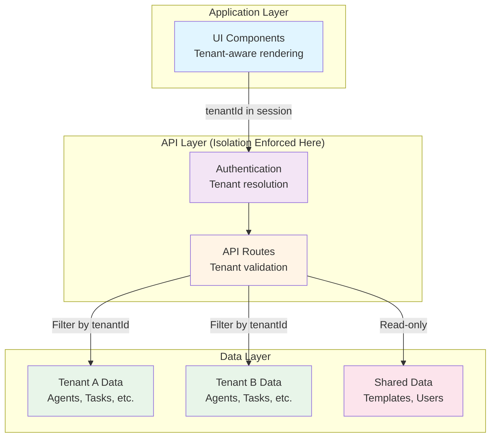
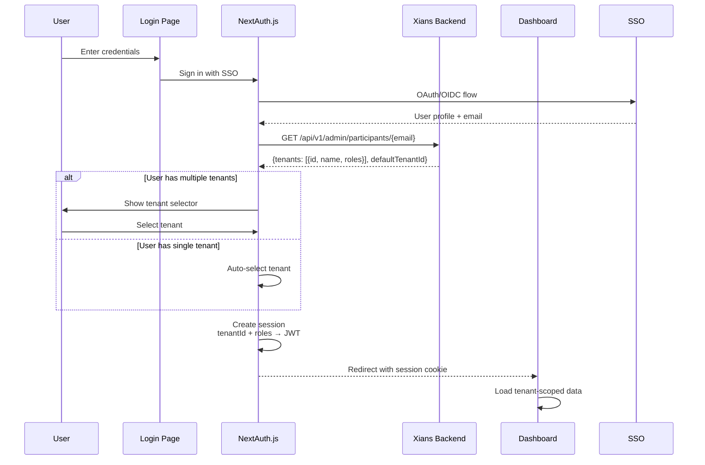
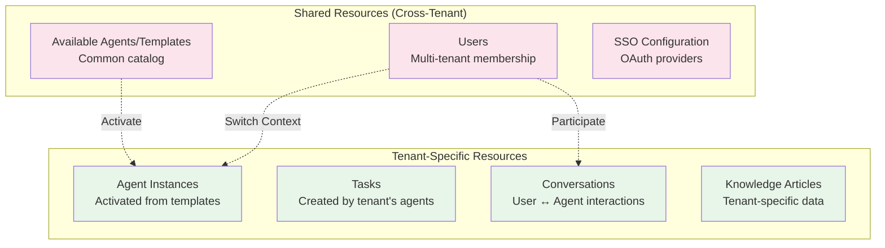

# Multi-Tenancy Architecture

**Version:** 1.0  
**Last Updated:** 2026-07-16  
**Status:** Active

---

## Table of Contents

1. [Overview](#overview)
2. [Tenant Isolation Model](#tenant-isolation-model)
3. [Tenant Resolution Flow](#tenant-resolution-flow)
4. [Shared vs Tenant-Specific Resources](#shared-vs-tenant-specific-resources)
5. [Cross-Tenant Operations](#cross-tenant-operations)
6. [Resource Limits and Quotas](#resource-limits-and-quotas)
7. [Implementation Guide](#implementation-guide)

**Related Documents:**
- **[System Overview](./SYSTEM_OVERVIEW.md)** - Overall architecture
- **[Data Model](./DATA_MODEL.md)** - Entity relationships
- **[Security Architecture](./SECURITY_ARCHITECTURE.md)** - Security controls
- **[Authorization Model](../auth/authorization-model.md)** - BFF trust model
- **[Tenant Implementation](../auth/TENANT_IMPLEMENTATION.md)** - Code-level details

---

## Overview

Agent Studio implements **complete multi-tenancy** where multiple organizations (tenants) share the same application instance while maintaining strict data isolation and resource segregation.

### Multi-Tenancy Characteristics

- **Isolation Level:** Complete data isolation per tenant
- **Sharing Model:** Shared application, isolated data
- **Tenant Context:** Established at authentication, maintained throughout session
- **Resource Segregation:** All operations tenant-scoped
- **Cross-Tenant Access:** Only for SysAdmin via explicit operations

### Key Principles

1. **Default Deny:** All operations require explicit tenant context
2. **No Ambient Authority:** Tenant ID never inferred from ambient state
3. **Fail Secure:** Missing tenant context results in error, not default
4. **Audit Everything:** All tenant switches and cross-tenant operations logged

---

## Tenant Isolation Model

### Isolation Boundaries



### Tenant Isolation Layers

| Layer | Isolation Mechanism | Example |
|-------|---------------------|---------|
| **UI Layer** | Conditional rendering based on tenant | Show tenant-specific agents only |
| **API Layer** | Explicit tenant ID validation | `if (session.user.tenantId !== requestedTenantId) return 403` |
| **Data Layer** | Backend enforces `tenantId` filter on queries | `WHERE tenantId = @tenantId` |
| **Session Layer** | Tenant ID in JWT token | `token.tenantId = "tenant-123"` |

### Isolation Guarantees

**Guaranteed Isolation:**
- ✅ Agent Instances (tenant-specific deployments)
- ✅ Tasks (created by tenant's agents)
- ✅ Conversations (between tenant's users and agents)
- ✅ Knowledge Articles (tenant-specific data)
- ✅ Performance Metrics (tenant-scoped analytics)
- ✅ API Keys (tenant-scoped service credentials)

**Shared Resources:**
- 🔗 Available Agents / Templates (common catalog)
- 🔗 Users (can belong to multiple tenants)
- 🔗 SSO Providers (shared OAuth configuration)
- 🔗 System Configuration (platform-wide settings)

---

## Tenant Resolution Flow

### Authentication Flow with Tenant Selection



### Tenant Context Lifecycle

```
┌─────────────────────────────────────────────────────┐
│ 1. LOGIN                                             │
│    ├─ User authenticates via SSO                     │
│    ├─ Backend returns available tenants              │
│    └─ User selects tenant (or auto-selected)         │
└─────────────────────────────────────────────────────┘
                      ↓
┌─────────────────────────────────────────────────────┐
│ 2. SESSION CREATION                                  │
│    ├─ JWT token includes:                            │
│    │  ├─ tenantId: "tenant-123"                      │
│    │  ├─ tenants: [{id, name, roles}]                │
│    │  └─ capabilities: Set<string>                   │
│    └─ Session cookie (httpOnly, secure)              │
└─────────────────────────────────────────────────────┘
                      ↓
┌─────────────────────────────────────────────────────┐
│ 3. REQUEST PROCESSING                                │
│    ├─ Every API request includes session cookie      │
│    ├─ Middleware extracts tenantId from session      │
│    ├─ API route validates tenant access              │
│    └─ Backend filters data by tenantId               │
└─────────────────────────────────────────────────────┘
                      ↓
┌─────────────────────────────────────────────────────┐
│ 4. TENANT SWITCH (Optional)                          │
│    ├─ User clicks tenant selector                    │
│    ├─ POST /api/auth/switch-tenant                   │
│    ├─ Update JWT with new tenantId                   │
│    ├─ Refresh session                                │
│    └─ Reload dashboard with new tenant data          │
└─────────────────────────────────────────────────────┘
```

### Tenant Context in Code

```typescript
// Server Component: Automatically has session
import { getServerSession } from 'next-auth';
import { authOptions } from '@/app/api/auth/[...nextauth]/route';

export default async function AgentsPage() {
  const session = await getServerSession(authOptions);
  
  if (!session?.user?.tenantId) {
    redirect('/login');
  }
  
  // Tenant context available
  const tenantId = session.user.tenantId;
  const agents = await fetchAgents(tenantId);
  
  return <AgentList agents={agents} />;
}

// API Route: Validate tenant access
export async function GET(request: Request) {
  const session = await getServerSession(authOptions);
  
  if (!session?.user?.tenantId) {
    return NextResponse.json({ error: 'Unauthorized' }, { status: 401 });
  }
  
  // Every backend call includes tenantId
  const data = await xiansClient.getAgents(session.user.tenantId);
  
  return NextResponse.json({ success: true, data });
}

// Client Component: Access session via hook
'use client';

import { useSession } from 'next-auth/react';

export function TenantBadge() {
  const { data: session } = useSession();
  
  if (!session?.user?.tenantId) return null;
  
  const currentTenant = session.user.tenants.find(
    t => t.id === session.user.tenantId
  );
  
  return <Badge>{currentTenant?.name}</Badge>;
}
```

---

## Shared vs Tenant-Specific Resources

### Resource Classification



### Resource Ownership Matrix

| Resource | Owner | Visibility | Operations |
|----------|-------|------------|------------|
| **Available Agents** | Platform | All tenants | Read by all, Create/Update by SysAdmin only |
| **Agent Instances** | Tenant | Single tenant | Full CRUD within tenant, isolated from others |
| **Tasks** | Tenant | Single tenant | Full CRUD within tenant, filtered by tenantId |
| **Conversations** | Tenant | Single tenant | Full CRUD within tenant, participant-scoped |
| **Knowledge Articles** | Tenant | Single tenant | Full CRUD within tenant, isolated storage |
| **Users** | Platform | Multi-tenant | User can access multiple tenants based on membership |
| **Tenants** | Platform | SysAdmin only | Create/Update by SysAdmin, Read by members |

### Shared Resource Pattern: Available Agents

```typescript
// Available Agents (Templates) are shared
export async function GET() {
  const session = await getServerSession(authOptions);
  
  // Any authenticated user can list templates
  const templates = await xiansClient.getTemplates();  // No tenantId filter
  
  return NextResponse.json({ success: true, data: templates });
}

// Activating a template creates a tenant-specific instance
export async function POST(request: Request) {
  const session = await getServerSession(authOptions);
  const { templateId, name } = await request.json();
  
  // Create agent instance scoped to user's tenant
  const agent = await xiansClient.createAgent({
    tenantId: session.user.tenantId,  // ← Tenant-scoped
    templateId,
    name,
  });
  
  return NextResponse.json({ success: true, data: agent });
}
```

### Multi-Tenant User Pattern

```typescript
// User can belong to multiple tenants
interface User {
  id: string;
  email: string;
  name: string;
  tenants: Array<{
    id: string;
    name: string;
    roles: string[];  // Roles are per-tenant
  }>;
  defaultTenantId: string;
}

// Role resolution is always tenant-specific
function getUserRoles(user: User, tenantId: string): string[] {
  const tenant = user.tenants.find(t => t.id === tenantId);
  return tenant?.roles || [];
}
```

---

## Cross-Tenant Operations

### SysAdmin Cross-Tenant Access

**System Administrators** can perform cross-tenant operations for platform management.

```typescript
// Example: List all agents across all tenants (SysAdmin only)
export async function GET(request: Request) {
  const session = await getServerSession(authOptions);
  
  // Check SysAdmin capability
  if (!session.user.capabilities.has('system:admin')) {
    return NextResponse.json({ error: 'Forbidden' }, { status: 403 });
  }
  
  // SysAdmin can query without tenant filter
  const allAgents = await xiansClient.getAllAgents();  // Cross-tenant
  
  return NextResponse.json({ success: true, data: allAgents });
}
```

### Tenant Management

```typescript
// Platform admin operations
interface TenantManagementOperations {
  // Create new tenant
  createTenant(data: CreateTenantInput): Promise<Tenant>;
  
  // List all tenants (SysAdmin only)
  listTenants(): Promise<Tenant[]>;
  
  // Update tenant settings
  updateTenant(tenantId: string, data: UpdateTenantInput): Promise<Tenant>;
  
  // Add user to tenant
  addUserToTenant(tenantId: string, userId: string, roles: string[]): Promise<void>;
  
  // Remove user from tenant
  removeUserFromTenant(tenantId: string, userId: string): Promise<void>;
}
```

### Audit Logging for Cross-Tenant Operations

```typescript
// All cross-tenant operations must be audited
async function auditCrossTenantAccess(params: {
  userId: string;
  action: string;
  sourceTenantId: string | null;
  targetTenantId: string;
  resourceType: string;
  resourceId: string;
}) {
  await xiansClient.createAuditLog({
    ...params,
    timestamp: new Date().toISOString(),
    ip: request.headers.get('x-forwarded-for'),
  });
}
```

---

## Resource Limits and Quotas

### Tenant-Level Quotas

```typescript
interface TenantQuotas {
  maxAgents: number;           // Max active agent instances
  maxConversations: number;     // Max concurrent conversations
  maxKnowledgeArticles: number; // Max knowledge base size
  maxStorageGB: number;         // Max file storage
  apiRateLimit: number;         // Requests per minute
}

// Default quotas by tier
const QUOTA_TIERS = {
  free: {
    maxAgents: 3,
    maxConversations: 10,
    maxKnowledgeArticles: 50,
    maxStorageGB: 1,
    apiRateLimit: 60,
  },
  pro: {
    maxAgents: 20,
    maxConversations: 100,
    maxKnowledgeArticles: 500,
    maxStorageGB: 50,
    apiRateLimit: 600,
  },
  enterprise: {
    maxAgents: Infinity,
    maxConversations: Infinity,
    maxKnowledgeArticles: Infinity,
    maxStorageGB: 1000,
    apiRateLimit: 6000,
  },
};
```

### Quota Enforcement

```typescript
// Enforce quotas at API layer
export async function POST(request: Request) {
  const session = await getServerSession(authOptions);
  
  // Check current usage vs quota
  const usage = await getTenantUsage(session.user.tenantId);
  const quotas = await getTenantQuotas(session.user.tenantId);
  
  if (usage.agentCount >= quotas.maxAgents) {
    return NextResponse.json({
      error: 'Quota exceeded',
      code: 'QUOTA_EXCEEDED',
      details: {
        quota: quotas.maxAgents,
        current: usage.agentCount,
      },
    }, { status: 429 });
  }
  
  // Proceed with creation
  const agent = await xiansClient.createAgent({
    tenantId: session.user.tenantId,
    ...data,
  });
  
  return NextResponse.json({ success: true, data: agent });
}
```

### Rate Limiting

```typescript
// Rate limit per tenant
import { Ratelimit } from '@upstash/ratelimit';
import { Redis } from '@upstash/redis';

const ratelimit = new Ratelimit({
  redis: Redis.fromEnv(),
  limiter: Ratelimit.slidingWindow(60, '1 m'),  // 60 requests per minute
  prefix: 'ratelimit:tenant:',
});

export async function middleware(request: Request) {
  const session = await getSession(request);
  
  if (session?.user?.tenantId) {
    const { success, limit, remaining } = await ratelimit.limit(
      session.user.tenantId
    );
    
    if (!success) {
      return new Response('Rate limit exceeded', {
        status: 429,
        headers: {
          'X-RateLimit-Limit': limit.toString(),
          'X-RateLimit-Remaining': remaining.toString(),
        },
      });
    }
  }
  
  return NextResponse.next();
}
```

---

## Implementation Guide

### Checklist for Tenant-Aware Features

When implementing a new feature, ensure:

- [ ] **Authentication:** Route checks for valid session with `tenantId`
- [ ] **Authorization:** Validate user has capability for tenant operation
- [ ] **Data Fetching:** All queries include `tenantId` filter
- [ ] **Data Mutations:** All creates/updates include `tenantId`
- [ ] **UI Rendering:** Components show only tenant-scoped data
- [ ] **Error Handling:** Return 403 if tenant access denied
- [ ] **Audit Logging:** Log all sensitive tenant operations
- [ ] **Testing:** Test with multiple tenants, ensure isolation

### Common Pitfalls

❌ **Don't:**
```typescript
// BAD: No tenant validation
export async function GET() {
  const agents = await xiansClient.getAllAgents();  // ← Leaks data!
  return NextResponse.json({ data: agents });
}

// BAD: Client-provided tenant ID
export async function GET(request: Request) {
  const { tenantId } = await request.json();  // ← User can fake tenantId!
  const agents = await xiansClient.getAgents(tenantId);
  return NextResponse.json({ data: agents });
}
```

✅ **Do:**
```typescript
// GOOD: Tenant from authenticated session
export async function GET(request: Request) {
  const session = await getServerSession(authOptions);
  
  if (!session?.user?.tenantId) {
    return NextResponse.json({ error: 'Unauthorized' }, { status: 401 });
  }
  
  // Tenant ID from trusted session, not user input
  const agents = await xiansClient.getAgents(session.user.tenantId);
  return NextResponse.json({ success: true, data: agents });
}
```

### Testing Multi-Tenancy

```typescript
// Test tenant isolation
describe('Agent API', () => {
  it('should not return agents from other tenants', async () => {
    // Setup: Create agents in two tenants
    const tenant1Agent = await createAgent({ tenantId: 'tenant-1' });
    const tenant2Agent = await createAgent({ tenantId: 'tenant-2' });
    
    // Act: Fetch as tenant-1 user
    const response = await fetchAgents({ tenantId: 'tenant-1' });
    
    // Assert: Only tenant-1 agent returned
    expect(response.data).toContainEqual(expect.objectContaining({
      id: tenant1Agent.id,
    }));
    expect(response.data).not.toContainEqual(expect.objectContaining({
      id: tenant2Agent.id,
    }));
  });
});
```

---

## Summary

Agent Studio's multi-tenancy architecture ensures:

1. **Complete Isolation:** Tenant data never leaks across boundaries
2. **Clear Ownership:** Explicit tenant context in all operations
3. **Secure by Default:** Missing tenant context fails safely
4. **Flexible Sharing:** Users can belong to multiple tenants
5. **Auditable:** All cross-tenant operations logged

### Key Takeaways

- **Tenant ID comes from session,** never from user input
- **All data operations are tenant-scoped** at the API layer
- **Shared resources** (templates, users) coexist with tenant-specific resources
- **SysAdmin operations** require explicit capability checks
- **Test tenant isolation** rigorously in all new features

For implementation details:
- Code patterns → [../auth/TENANT_IMPLEMENTATION.md](../auth/TENANT_IMPLEMENTATION.md)
- Client integration → [../auth/TENANT_CLIENT_INTEGRATION.md](../auth/TENANT_CLIENT_INTEGRATION.md)
- Usage examples → [../auth/TENANT_USAGE.md](../auth/TENANT_USAGE.md)

---

**Maintained By:** Development Team  
**Review Schedule:** Quarterly or after tenant-related changes  
**Critical:** Any changes to tenant isolation must be security-reviewed
