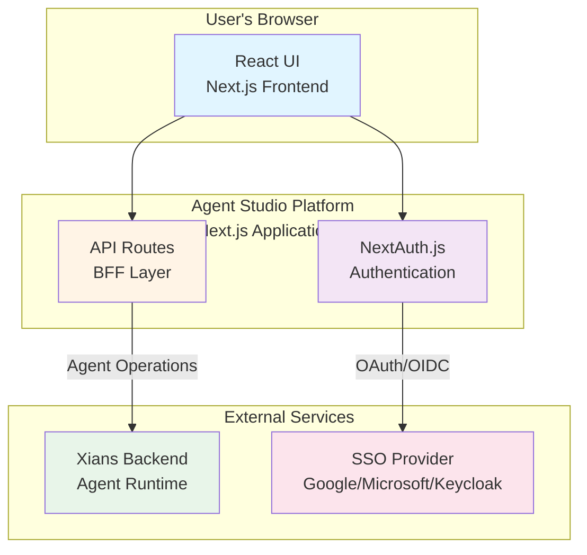

# Architecture Documentation

**Version:** 1.0  
**Last Updated:** 2026-07-16  
**Status:** Active

---

## Overview

This directory contains the comprehensive architecture documentation for Agent Studio. These documents explain the system design, technical decisions, and architectural patterns that guide implementation.

**Related Documentation:**
- **[Product Requirements](../requirements.md)** - What we're building
- **[Technology Stack](../technology.md)** - Tech choices and rationale
- **[Implementation Guide](../development.md)** - Development workflow

---

## Architecture Documents

### Core Architecture

| Document | Description | Audience |
|----------|-------------|----------|
| **[SYSTEM_OVERVIEW.md](./SYSTEM_OVERVIEW.md)** | End-to-end system architecture with BFF model | All developers, architects |
| **[MULTI_TENANCY.md](./MULTI_TENANCY.md)** | Multi-tenant isolation and resource management | Backend developers, architects |
| **[DATA_MODEL.md](./DATA_MODEL.md)** | Entity relationships and data flow | All developers, DBAs |
| **[API_CONTRACT.md](./API_CONTRACT.md)** | REST API specification and patterns | API developers, integrators |
| **[SECURITY_ARCHITECTURE.md](./SECURITY_ARCHITECTURE.md)** | Security controls and threat model | All developers, security team |

### Additional Architecture Topics

| Topic | Location | Description |
|-------|----------|-------------|
| **Authentication & Authorization** | [../auth/authorization-model.md](../auth/authorization-model.md) | BFF trust model, RBAC, SSO |
| **Real-time Messaging** | [../implementation-notes/SSE_REAL_TIME_MESSAGING.md](../implementation-notes/SSE_REAL_TIME_MESSAGING.md) | SSE implementation for streaming |
| **Frontend Architecture** | [../layout.md](../layout.md) | Component hierarchy, routing |
| **Deployment** | [../deploy/README.md](../deploy/README.md) | Docker, CI/CD, infrastructure |

---

## Quick Navigation

### "I want to understand..."

| Goal | Start Here |
|------|------------|
| Overall system design | [SYSTEM_OVERVIEW.md](./SYSTEM_OVERVIEW.md) |
| How tenant isolation works | [MULTI_TENANCY.md](./MULTI_TENANCY.md) |
| Database schema and entities | [DATA_MODEL.md](./DATA_MODEL.md) |
| API endpoints and contracts | [API_CONTRACT.md](./API_CONTRACT.md) |
| Security model and controls | [SECURITY_ARCHITECTURE.md](./SECURITY_ARCHITECTURE.md) |
| How authentication works | [../auth/authorization-model.md](../auth/authorization-model.md) |
| Real-time streaming architecture | [../implementation-notes/SSE_REAL_TIME_MESSAGING.md](../implementation-notes/SSE_REAL_TIME_MESSAGING.md) |

---

## Architecture Principles

Agent Studio follows these architectural principles:

### 1. **Backend-for-Frontend (BFF) Pattern**
- Next.js API routes act as a trusted intermediary
- Frontend never directly calls external services
- Security boundary at the API layer
- See: [authorization-model.md](../auth/authorization-model.md)

### 2. **Multi-Tenancy by Design**
- Complete tenant isolation at all layers
- Tenant context established at authentication
- All data operations tenant-scoped
- See: [MULTI_TENANCY.md](./MULTI_TENANCY.md)

### 3. **Server Components First**
- Prefer React Server Components for data fetching
- Client Components only for interactivity
- Reduces client bundle size
- See: [../technology.md](../technology.md)

### 4. **Type Safety Throughout**
- TypeScript strict mode across the stack
- Zod for runtime validation
- Shared types between client and server
- See: [DATA_MODEL.md](./DATA_MODEL.md)

### 5. **Progressive Enhancement**
- Phased backend approach (dummy → external)
- Feature flags for gradual rollout
- Graceful degradation
- See: [../technology.md#backend-architecture](../technology.md#backend-architecture)

### 6. **Security Layered Defense**
- Authentication at edge (NextAuth.js)
- Authorization in API routes
- Tenant isolation in data layer
- See: [SECURITY_ARCHITECTURE.md](./SECURITY_ARCHITECTURE.md)

---

## Architecture Decision Records (ADRs)

For detailed context on key architectural decisions, see:

| Decision | Rationale | Document |
|----------|-----------|----------|
| BFF Model | Security, flexibility, frontend simplicity | [../auth/authorization-model.md](../auth/authorization-model.md) |
| SSE over WebSockets | Simpler, better for one-way streaming | [../implementation-notes/SSE_REAL_TIME_MESSAGING.md](../implementation-notes/SSE_REAL_TIME_MESSAGING.md) |
| Phased Backend | Parallel development, easy migration | [../technology.md#phased-implementation-strategy](../technology.md#phased-implementation-strategy) |
| shadcn/ui | Code ownership, accessibility, flexibility | [../theme.md#component-library-decision](../theme.md#component-library-decision) |
| Next.js App Router | Server Components, modern patterns | [../technology.md#core-technologies](../technology.md#core-technologies) |

---

## System Context Diagram

**Key Points:**
- Frontend only communicates with its own API routes (BFF pattern)
- API routes handle all external service integration
- Authentication managed by NextAuth.js with SSO providers
- Xians backend provides agent runtime and data persistence

For detailed architecture, see [SYSTEM_OVERVIEW.md](./SYSTEM_OVERVIEW.md).

---

## For New Developers

### Getting Started with Architecture

**Day 1: System Understanding**
1. Read [SYSTEM_OVERVIEW.md](./SYSTEM_OVERVIEW.md) - understand the big picture
2. Read [../auth/authorization-model.md](../auth/authorization-model.md) - understand BFF model
3. Review the system context diagram above

**Day 2: Data & API**
1. Read [DATA_MODEL.md](./DATA_MODEL.md) - understand entities
2. Read [API_CONTRACT.md](./API_CONTRACT.md) - understand API patterns
3. Review [MULTI_TENANCY.md](./MULTI_TENANCY.md) - understand tenant isolation

**Day 3: Security & Implementation**
1. Read [SECURITY_ARCHITECTURE.md](./SECURITY_ARCHITECTURE.md)
2. Review [../technology.md](../technology.md) for tech stack
3. Set up dev environment per [../development.md](../development.md)

---

## Contributing to Architecture Docs

When updating architecture documentation:

1. **Keep diagrams up to date** - Use Mermaid for consistency
2. **Update cross-references** - Link to related documents
3. **Version changes** - Update "Last Updated" date
4. **Follow conventions** - Match existing tone and structure
5. **Review guidelines** - See [../DOCUMENTATION_GUIDELINES.md](../DOCUMENTATION_GUIDELINES.md)

---

## Document Status

| Document | Status | Last Updated | Completeness |
|----------|--------|--------------|--------------|
| SYSTEM_OVERVIEW.md | ✅ Complete | 2026-07-16 | 95% |
| MULTI_TENANCY.md | ✅ Complete | 2026-07-16 | 95% |
| DATA_MODEL.md | ✅ Complete | 2026-07-16 | 90% |
| API_CONTRACT.md | ✅ Complete | 2026-07-16 | 85% |
| SECURITY_ARCHITECTURE.md | ✅ Complete | 2026-07-16 | 90% |

---

**Maintained By:** Development Team  
**Review Frequency:** Quarterly or after major architectural changes
