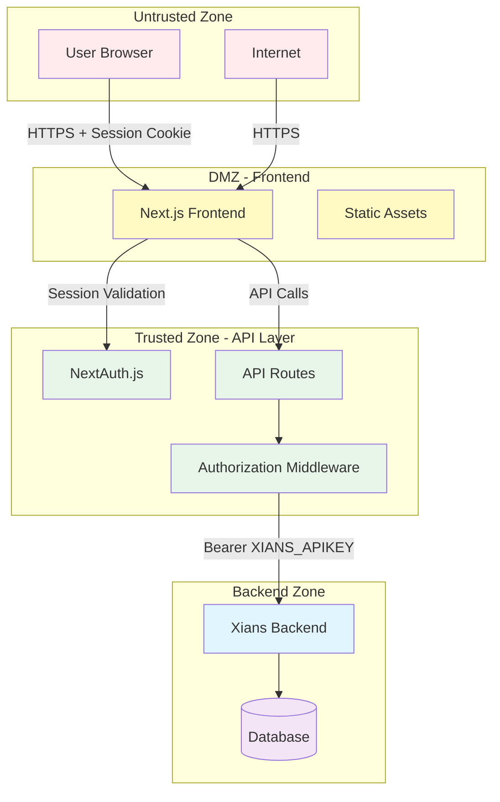
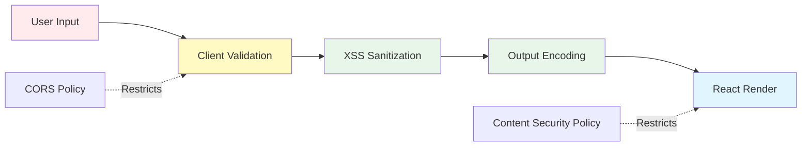
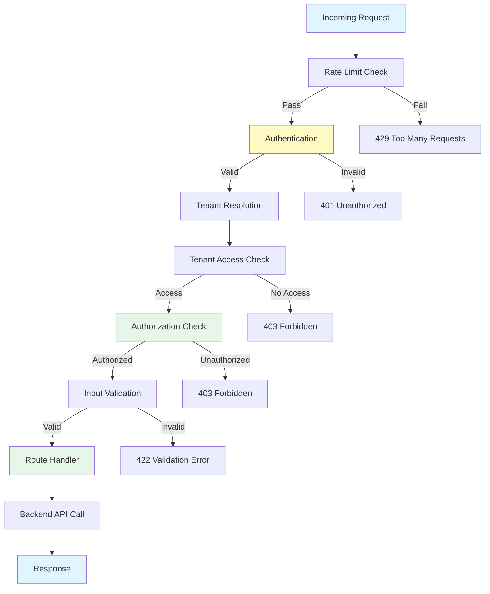
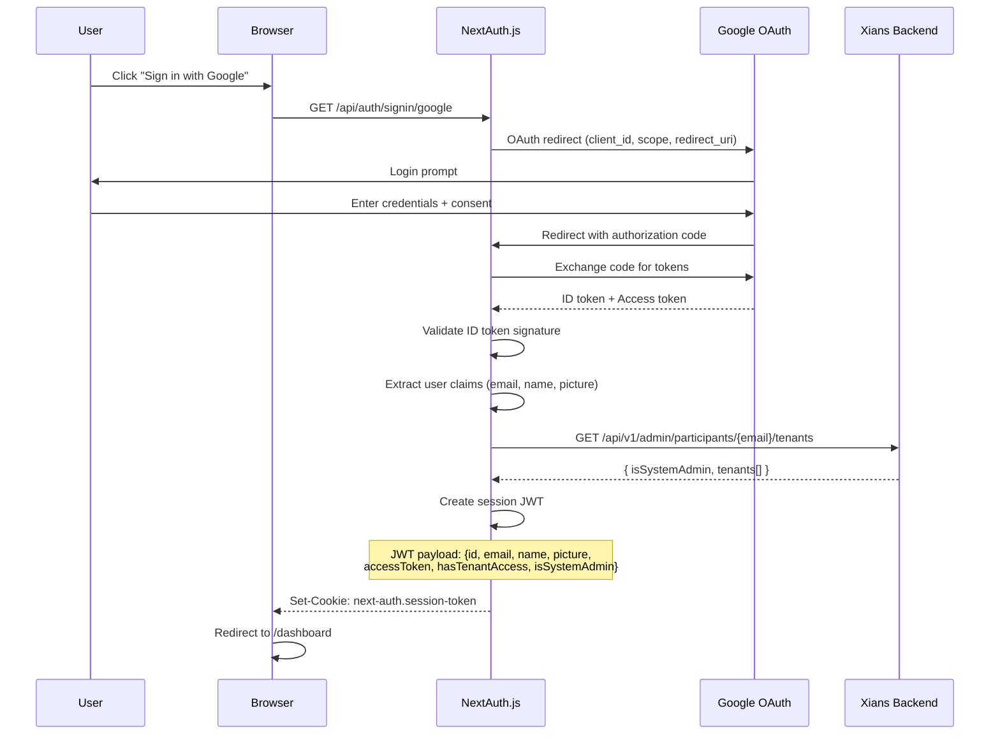

# Security Architecture

**Version:** 1.0  
**Last Updated:** 2026-07-16  
**Status:** Active

---

## Table of Contents

1. [Overview](#overview)
2. [Threat Model](#threat-model)
3. [Security Controls by Layer](#security-controls-by-layer)
4. [Authentication Architecture](#authentication-architecture)
5. [Authorization Model](#authorization-model)
6. [Secrets Management](#secrets-management)
7. [Data Protection](#data-protection)
8. [Network Security](#network-security)
9. [Audit Logging](#audit-logging)
10. [OWASP Top 10 Mitigations](#owasp-top-10-mitigations)
11. [Security Testing](#security-testing)
12. [Incident Response](#incident-response)

**Related Documents:**
- **[System Overview](./SYSTEM_OVERVIEW.md)** - BFF trust boundary
- **[Multi-Tenancy Architecture](./MULTI_TENANCY.md)** - Tenant isolation
- **[API Contract](./API_CONTRACT.md)** - API security requirements
- **[Authorization Model](../auth/authorization-model.md)** - Detailed authorization flows

---

## Overview

Agent Studio implements a **defense-in-depth security architecture** with multiple layers of protection. The Next.js BFF pattern establishes a clear trust boundary, with the API layer acting as the authoritative security enforcement point.

### Security Principles

1. **Least Privilege:** Users and services have minimal permissions required
2. **Defense in Depth:** Multiple security layers prevent single points of failure
3. **Fail Secure:** Security failures result in access denial, not bypass
4. **Zero Trust:** All requests authenticated and authorized, no implicit trust
5. **Audit Everything:** All security-relevant actions logged for forensics
6. **Secure by Default:** Safe defaults, explicit opt-in for risky operations

### Trust Boundaries



**Trust Boundary #1:** Browser → Next.js (authentication via session cookie)  
**Trust Boundary #2:** Next.js API Routes → Xians Backend (service credential)  
**Trust Boundary #3:** Xians Backend → Database (internal network + auth)

---

## Threat Model

### Assets

| Asset | Sensitivity | Threat Actors |
|-------|-------------|---------------|
| **User Credentials** | Critical | External attackers, malicious insiders |
| **Session Tokens** | Critical | XSS attacks, session hijacking |
| **Tenant Data** | Critical | Cross-tenant attacks, data leakage |
| **Service API Key (XIANS_APIKEY)** | Critical | Code injection, SSRF attacks |
| **Agent Configurations** | High | Unauthorized modification, IP theft |
| **Conversation History** | High | Privacy violations, data exfiltration |
| **Task Data** | Medium | Unauthorized access, tampering |
| **Knowledge Base** | Medium | Unauthorized disclosure, modification |

### Attack Vectors

#### 1. Frontend Attacks

**Threat:** Cross-Site Scripting (XSS)

- **Attack:** Malicious JavaScript injected into messages, task descriptions, or knowledge articles
- **Impact:** Session hijacking, data exfiltration, account takeover
- **Mitigation:** 
  - React auto-escaping of user content
  - Content Security Policy (CSP) headers
  - Sanitization of markdown content before rendering
  - DOMPurify for rich text inputs

**Threat:** Cross-Site Request Forgery (CSRF)

- **Attack:** Malicious site triggers authenticated requests to Agent Studio
- **Impact:** Unauthorized actions (message sending, task approval, setting changes)
- **Mitigation:**
  - SameSite cookies (Strict/Lax)
  - NextAuth.js CSRF tokens
  - Origin header validation

**Threat:** Client-Side Injection

- **Attack:** Malicious code injected via URL parameters or local storage
- **Impact:** XSS, open redirect, phishing
- **Mitigation:**
  - URL parameter validation
  - No eval() or Function() constructors
  - Strict TypeScript validation

#### 2. API Layer Attacks

**Threat:** Broken Authentication

- **Attack:** Session fixation, token theft, weak session management
- **Impact:** Account takeover, impersonation
- **Mitigation:**
  - Secure session cookies (httpOnly, secure, sameSite)
  - 30-day session expiration
  - Session invalidation on logout
  - Fresh authentication for sensitive operations

**Threat:** Broken Authorization

- **Attack:** Tenant ID manipulation, capability bypass, privilege escalation
- **Impact:** Cross-tenant data access, unauthorized operations
- **Mitigation:**
  - Server-side tenant resolution (never from client)
  - Capability-based authorization enforced at API layer
  - Defense-in-depth: middleware + route-level checks
  - Explicit rejection of client-supplied tenantId

**Threat:** Injection Attacks

- **Attack:** SQL injection, NoSQL injection, command injection
- **Impact:** Database compromise, remote code execution
- **Mitigation:**
  - Parameterized queries (MongoDB ODM)
  - Input validation with Zod schemas
  - No dynamic query construction from user input
  - Backend input sanitization

**Threat:** Mass Assignment

- **Attack:** Client sends unexpected fields to modify protected attributes
- **Impact:** Privilege escalation, data corruption
- **Mitigation:**
  - Explicit field whitelisting with Zod
  - No direct request body → database mapping
  - Server-side injection of tenantId, createdBy, etc.

#### 3. Backend Attacks

**Threat:** Service Credential Compromise

- **Attack:** XIANS_APIKEY leaked or stolen
- **Impact:** Full platform compromise, cross-tenant data access
- **Mitigation:**
  - Environment variable storage (never in code)
  - Minimal permission scope
  - Key rotation policy
  - Monitoring for unauthorized API calls

**Threat:** Server-Side Request Forgery (SSRF)

- **Attack:** Attacker tricks backend into making requests to internal services
- **Impact:** Internal network reconnaissance, credential theft
- **Mitigation:**
  - URL validation and allowlisting
  - No user-controlled URLs in backend requests
  - Network segmentation

**Threat:** Data Leakage

- **Attack:** Cross-tenant query bypassing tenantId filter
- **Impact:** Confidential data disclosure
- **Mitigation:**
  - Mandatory tenantId filter on all queries
  - Backend query validation
  - Row-level security (if supported by database)

#### 4. Infrastructure Attacks

**Threat:** DDoS (Distributed Denial of Service)

- **Attack:** Overwhelming the application with requests
- **Impact:** Service unavailability
- **Mitigation:**
  - Rate limiting at API layer
  - CDN-level DDoS protection (Vercel, Cloudflare)
  - Auto-scaling infrastructure

**Threat:** Man-in-the-Middle (MITM)

- **Attack:** Intercepting network traffic to steal credentials or data
- **Impact:** Credential theft, session hijacking
- **Mitigation:**
  - Mandatory HTTPS/TLS 1.3
  - HSTS (HTTP Strict Transport Security)
  - Certificate pinning (optional)

---

## Security Controls by Layer

### Frontend Layer Security



#### Control 1: Content Security Policy (CSP)

**Implementation:** Next.js headers

```typescript
// next.config.ts
const contentSecurityPolicy = `
  default-src 'self';
  script-src 'self' 'unsafe-eval' 'unsafe-inline';
  style-src 'self' 'unsafe-inline';
  img-src 'self' data: https:;
  font-src 'self' data:;
  connect-src 'self' ${process.env.XIANS_SERVER_URL};
  frame-ancestors 'none';
  base-uri 'self';
  form-action 'self';
`

export default {
  async headers() {
    return [
      {
        source: '/(.*)',
        headers: [
          {
            key: 'Content-Security-Policy',
            value: contentSecurityPolicy.replace(/\s{2,}/g, ' ').trim()
          }
        ]
      }
    ]
  }
}
```

**Purpose:** Prevent XSS by restricting resource loading

**Configuration:**
- `default-src 'self'` - Only load resources from same origin
- `script-src 'self' 'unsafe-eval'` - Required for Next.js dev mode
- `connect-src` - Whitelist Xians backend API
- `frame-ancestors 'none'` - Prevent clickjacking

#### Control 2: Input Validation

**Implementation:** Zod + React Hook Form

```typescript
import { z } from 'zod'

// Schema definition
const messageSchema = z.object({
  text: z.string()
    .min(1, 'Message cannot be empty')
    .max(10000, 'Message too long')
    .refine(val => !/<script/i.test(val), 'Script tags not allowed'),
  topic: z.string().max(100).optional(),
  attachments: z.array(z.object({
    type: z.enum(['task', 'file', 'link']),
    id: z.string().uuid()
  })).max(10).optional()
})

// Validation
const result = messageSchema.safeParse(userInput)
if (!result.success) {
  // Show validation errors
  return
}

// Validated data
const validatedData = result.data
```

**Rules:**
- All user inputs validated before submission
- Length limits enforced (prevent DoS)
- Type validation (prevent type confusion)
- Format validation (email, URL, UUID)
- Pattern validation (no script tags, SQL keywords)

#### Control 3: XSS Prevention

**Implementation:** React auto-escaping + DOMPurify

```typescript
import DOMPurify from 'dompurify'
import { marked } from 'marked'

// Markdown rendering with sanitization
function renderMarkdown(content: string): string {
  const html = marked(content)
  return DOMPurify.sanitize(html, {
    ALLOWED_TAGS: ['p', 'br', 'strong', 'em', 'ul', 'ol', 'li', 'code', 'pre', 'a'],
    ALLOWED_ATTR: ['href', 'title'],
    ALLOW_DATA_ATTR: false
  })
}

// Safe rendering
<div dangerouslySetInnerHTML={{ __html: renderMarkdown(message.content) }} />
```

**Protections:**
- React JSX escapes all interpolated values by default
- Markdown converted to HTML then sanitized
- Only safe HTML tags/attributes allowed
- No inline event handlers (onclick, onerror)
- No data: URIs for images (except specific cases)

#### Control 4: CSRF Protection

**Implementation:** NextAuth.js + SameSite cookies

```typescript
// Session cookie attributes
{
  httpOnly: true,
  secure: true,           // HTTPS only
  sameSite: 'lax',       // CSRF protection
  maxAge: 30 * 24 * 60 * 60  // 30 days
}

// Tenant cookie attributes
{
  httpOnly: true,
  secure: true,
  sameSite: 'strict',    // Stricter CSRF protection
  path: '/api',          // Only sent to API routes
  maxAge: 30 * 24 * 60 * 60
}
```

**Protections:**
- SameSite=Lax: Cookie not sent on cross-site POST requests
- SameSite=Strict: Cookie not sent on any cross-site request
- NextAuth.js CSRF token for state-changing operations
- Origin header validation in middleware

---

### API Layer Security



#### Control 5: Authentication Enforcement

**Implementation:** NextAuth.js middleware + session validation

```typescript
// middleware.ts
import { withAuth } from "next-auth/middleware"

export default withAuth(
  async function middleware(req) {
    const token = req.nextauth.token
    const path = req.nextUrl.pathname

    // Public paths
    const publicPaths = ['/login', '/no-access']
    if (publicPaths.some(p => path.startsWith(p))) {
      return NextResponse.next()
    }

    // All other paths require authentication
    if (!token) {
      return NextResponse.redirect(new URL('/login', req.url))
    }

    // Additional checks (capabilities, etc.)
    return NextResponse.next()
  },
  {
    callbacks: {
      authorized: ({ token }) => !!token,
    },
  }
)

export const config = {
  matcher: [
    "/dashboard/:path*",
    "/agents/:path*",
    "/conversations/:path*",
    // ... all protected routes
  ]
}
```

**Session Validation:**
- JWT signature verification (HS256 or RS256)
- Expiration check (exp claim)
- Issuer validation (iss claim)
- Audience validation (aud claim)

#### Control 6: Authorization Enforcement

**Implementation:** Capability-based middleware wrappers

```typescript
// withTenantFromSession: Standard tenant-scoped access
export const GET = withTenantFromSession(async (req, ctx) => {
  // ctx.tenantId resolved from cookie
  // ctx.session.user validated
  // No explicit capability required (any tenant member)
})

// withParticipantAdmin: Requires settings:view capability
export const POST = withParticipantAdmin(async (req, ctx) => {
  // Capability check: settings:view
  // TenantParticipantAdmin, TenantUser, TenantAdmin, or SysAdmin
})

// withTenantAdmin: Requires users:manage capability
export const PUT = withTenantAdmin(async (req, ctx) => {
  // Capability check: users:manage
  // TenantAdmin or SysAdmin only
})

// withSystemAdmin: Requires system:admin capability
export const DELETE = withSystemAdmin(async (req, ctx) => {
  // Capability check: system:admin
  // System administrators only, no tenant context
})
```

**Authorization Flow:**

```typescript
// Step 1: Validate session
const session = await getServerSession(authOptions)
if (!session) {
  return NextResponse.json({ error: 'Unauthorized' }, { status: 401 })
}

// Step 2: Resolve tenant from cookie (NEVER from client request)
const tenantId = getTenantIdFromCookie(request)
if (!tenantId) {
  return NextResponse.json({ error: 'No tenant selected' }, { status: 400 })
}

// Step 3: Fetch user's capabilities for this tenant
const capabilities = await getCapabilitiesFromSession(session, tenantId)

// Step 4: Check required capability
if (!hasCapability(capabilities, 'settings:view')) {
  return NextResponse.json({ error: 'Forbidden' }, { status: 403 })
}

// Step 5: Proceed to handler
return handler(request, { session, tenantId, capabilities })
```

#### Control 7: Tenant Context Protection

**Critical Security Control:** Prevent client-supplied tenant identity

```typescript
/**
 * Defense-in-depth guard: reject any client-supplied tenantId.
 * 
 * This function inspects:
 * 1. Query string (?tenantId=...)
 * 2. Request headers (X-Tenant-Id)
 * 3. JSON body ({ tenantId: ... })
 * 4. Form data (tenantId=...)
 * 
 * Any attempt to supply tenantId from the client is rejected with 400 Bad Request.
 * The ONLY valid source is the httpOnly current-tenant-id cookie.
 */
export async function rejectClientTenantId(
  request: NextRequest
): Promise<NextResponse | null> {
  const message =
    'tenantId must not be supplied by the client; it is resolved server-side from the session cookie'

  // 1. Query string
  if (request.nextUrl.searchParams.has('tenantId')) {
    return NextResponse.json({ error: message }, { status: 400 })
  }

  // 2. Request header
  if (request.headers.get('x-tenant-id')) {
    return NextResponse.json({ error: message }, { status: 400 })
  }

  // 3. Request body (JSON or form-encoded)
  const method = request.method.toUpperCase()
  if (method !== 'GET' && method !== 'HEAD') {
    const contentType = request.headers.get('content-type') ?? ''
    try {
      if (contentType.includes('application/json')) {
        const body = await request.clone().json()
        if (body && typeof body === 'object' && 'tenantId' in body) {
          return NextResponse.json({ error: message }, { status: 400 })
        }
      } else if (
        contentType.includes('application/x-www-form-urlencoded') ||
        contentType.includes('multipart/form-data')
      ) {
        const form = await request.clone().formData()
        if (form.has('tenantId')) {
          return NextResponse.json({ error: message }, { status: 400 })
        }
      }
    } catch {
      // Unparseable body — nothing to reject
    }
  }

  return null // No client-supplied tenantId detected
}
```

**Why This Matters:**
- Prevents Insecure Direct Object Reference (IDOR) attacks
- Prevents horizontal privilege escalation (accessing other tenants' data)
- Enforces architectural principle: tenant context is server-side authority

#### Control 8: Input Validation (Server-Side)

**Implementation:** Zod schemas + validation middleware

```typescript
// Schema definition
const createTaskSchema = z.object({
  title: z.string().min(1).max(200),
  description: z.string().min(10).max(10000),
  priority: z.enum(['low', 'medium', 'high', 'urgent']),
  dueDate: z.string().datetime().optional(),
  assignedTo: z.string().uuid().optional()
})

// Validation middleware
export async function validateRequest<T>(
  request: NextRequest,
  schema: z.ZodSchema<T>
): Promise<{ success: true; data: T } | { success: false; errors: any }> {
  try {
    const body = await request.json()
    const result = schema.safeParse(body)
    
    if (!result.success) {
      return {
        success: false,
        errors: result.error.flatten().fieldErrors
      }
    }
    
    return {
      success: true,
      data: result.data
    }
  } catch (error) {
    return {
      success: false,
      errors: { _error: 'Invalid JSON body' }
    }
  }
}

// Usage in route handler
export const POST = withTenantFromSession(async (req, ctx) => {
  const validation = await validateRequest(req, createTaskSchema)
  
  if (!validation.success) {
    return NextResponse.json(
      { error: 'Validation failed', details: validation.errors },
      { status: 422 }
    )
  }
  
  const data = validation.data
  // Proceed with validated data
})
```

**Validation Rules:**
- All inputs validated before use
- Whitelist approach (only known fields accepted)
- Type safety (TypeScript + runtime validation)
- Length limits (prevent DoS)
- Format validation (email, URL, UUID, datetime)

#### Control 9: Rate Limiting

**Implementation:** In-memory rate limiter with token bucket algorithm

```typescript
// Simple rate limiter (production should use Redis)
const rateLimitMap = new Map<string, { count: number; resetAt: number }>()

function rateLimit(
  key: string,
  limit: number,
  windowMs: number
): { allowed: boolean; retryAfter?: number } {
  const now = Date.now()
  const record = rateLimitMap.get(key)
  
  if (!record || now > record.resetAt) {
    // New window
    rateLimitMap.set(key, { count: 1, resetAt: now + windowMs })
    return { allowed: true }
  }
  
  if (record.count >= limit) {
    // Limit exceeded
    const retryAfter = Math.ceil((record.resetAt - now) / 1000)
    return { allowed: false, retryAfter }
  }
  
  // Increment count
  record.count++
  return { allowed: true }
}

// Middleware usage
export const POST = withTenantFromSession(async (req, ctx) => {
  const key = `${ctx.session.user.id}:${ctx.tenantId}:send-message`
  const result = rateLimit(key, 60, 60000) // 60 requests per minute
  
  if (!result.allowed) {
    return NextResponse.json(
      {
        error: 'Rate limit exceeded',
        retryAfter: result.retryAfter
      },
      {
        status: 429,
        headers: {
          'Retry-After': String(result.retryAfter)
        }
      }
    )
  }
  
  // Proceed with request
})
```

**Rate Limits:**
- Authentication: 10 req/min per IP
- Message sending: 60 req/min per user+tenant
- Task creation: 30 req/min per user+tenant
- Knowledge write: 20 req/min per user+tenant
- General API: 300 req/min per user+tenant

---

### Backend Layer Security

#### Control 10: Service Credential Security

**Implementation:** Environment variable + minimal permissions

```typescript
// XIANS_APIKEY stored in environment variable
const XIANS_APIKEY = process.env.XIANS_APIKEY

if (!XIANS_APIKEY) {
  throw new Error('XIANS_APIKEY environment variable is required')
}

// Create authenticated client
function createXiansClient(userAccessToken?: string) {
  return axios.create({
    baseURL: process.env.XIANS_SERVER_URL,
    headers: {
      'Authorization': `Bearer ${XIANS_APIKEY}`,
      'X-User-Token': userAccessToken || '',  // Optional user context
      'Content-Type': 'application/json'
    }
  })
}
```

**Protection:**
- Never committed to source control (.env in .gitignore)
- Stored in secure environment variables (Vercel secrets, Docker secrets)
- Minimal permission scope (admin API access only)
- Rotated periodically (quarterly)
- Monitored for unauthorized use

#### Control 11: Backend Request Validation

**Implementation:** Tenant ID injection + backend validation

```typescript
export const POST = withTenantFromSession(async (req, ctx) => {
  const { tenantId, session } = ctx
  const body = await req.json()
  
  // CRITICAL: BFF injects tenantId, createdBy server-side
  const client = createXiansClient()
  const response = await client.post('/api/v1/admin/tasks', {
    ...body,                    // Validated user input
    tenantId,                   // Injected from cookie
    createdBy: session.user.id  // Injected from session
  })
  
  return NextResponse.json(response.data)
})
```

**Backend Responsibilities:**
- Validate tenantId matches authenticated service
- Enforce tenantId filter on all queries
- Validate foreign key references (e.g., agentName exists in tenant)
- Prevent cross-tenant references

#### Control 12: Data Encryption

**At Rest:**
- Database: MongoDB encryption at rest (AES-256)
- Secrets: Environment variables encrypted by platform
- Backups: Encrypted with separate key

**In Transit:**
- Client ↔ Next.js: TLS 1.3 (HTTPS)
- Next.js ↔ Xians Backend: TLS 1.3 (HTTPS)
- Backend ↔ Database: TLS 1.2+ (MongoDB wire protocol)

**Sensitive Fields:**
- Passwords: Never stored (SSO only)
- API Keys: Hashed before storage (bcrypt or Argon2)
- Tokens: Short-lived JWTs (30-day max)

---

## Authentication Architecture

### SSO Flow (Google OAuth 2.0)



### Session Management

**Session Lifecycle:**

1. **Creation:** After successful SSO authentication
2. **Validation:** On every request via middleware
3. **Refresh:** Automatic (30-day sliding window)
4. **Invalidation:** On logout or security event

**Session Storage:**
- **JWT Token:** Stateless, signed with HMAC-SHA256 or RSA
- **Cookie:** httpOnly, secure, sameSite
- **Server-Side:** Optional database session for revocation

**Session Claims:**

```json
{
  "sub": "user-123",
  "email": "user@example.com",
  "name": "John Doe",
  "picture": "https://example.com/avatar.jpg",
  "accessToken": "ya29.a0AfH6SMB...",
  "provider": "google",
  "hasTenantAccess": true,
  "isSystemAdmin": false,
  "iat": 1689440000,
  "exp": 1692032000
}
```

### Multi-Factor Authentication (MFA)

**Status:** Optional (SSO provider-managed)

Agent Studio delegates MFA to SSO providers:
- **Google:** Google Authenticator, SMS, hardware keys
- **Microsoft:** Microsoft Authenticator, SMS, hardware keys
- **Keycloak:** OTP, WebAuthn

**Enforcement:**
- Recommended for all users
- Required for system administrators
- Enforced at SSO provider level

---

## Authorization Model

### Capability-Based Access Control

```mermaid
graph TD
    User[User Login] --> Backend[Backend API Call]
    Backend -->|GET /participants/{email}/tenants| Roles[Fetch User Roles]
    Roles --> Mapping[Map Roles to Capabilities]
    
    Mapping -->|TenantParticipant| Cap1[conversations:read/write<br/>tasks:read]
    Mapping -->|TenantParticipantAdmin| Cap2[agents:*, knowledge:*<br/>settings:*, tasks:review]
    Mapping -->|TenantAdmin| Cap3[+ users:manage]
    Mapping -->|SystemAdmin| Cap4[system:admin + all]
    
    Cap1 --> Cache[Cache Capabilities]
    Cap2 --> Cache
    Cap3 --> Cache
    Cap4 --> Cache
    
    Cache --> Enforce[Enforce at API Layer]
    
    style User fill:#e1f5fe
    style Roles fill:#fff9c4
    style Mapping fill:#e8f5e9
    style Enforce fill:#ffebee
```

### Role Hierarchy

```
System Administrator (system:admin)
│
├── Platform-Wide Capabilities
│   ├── View all tenants
│   ├── Enable/disable tenants
│   ├── View platform metrics
│   └── Access system-admin routes
│
└── All Tenant-Level Capabilities (when acting within a tenant)

Tenant Administrator (TenantAdmin)
│
├── User Management (users:manage)
│   ├── Invite users
│   ├── Remove users
│   ├── Assign roles
│   └── View user list
│
└── All Settings & Agent Capabilities

Tenant Participant Admin (TenantParticipantAdmin)
│
├── Agent Management (agents:*)
│   ├── Create agents
│   ├── Update agents
│   ├── Activate/deactivate agents
│   └── Delete agents
│
├── Knowledge Management (knowledge:*)
│   ├── Create articles
│   ├── Edit articles
│   ├── Publish articles
│   └── Delete articles
│
├── Settings Management (settings:*)
│   ├── View settings
│   ├── Edit branding
│   ├── Configure integrations
│   └── Manage schedules
│
└── Task Review (tasks:review)
    ├── Approve tasks
    └── Reject tasks

Tenant Participant (TenantParticipant)
│
├── Conversation Participation (conversations:*)
│   ├── View conversations
│   ├── Send messages
│   └── Provide feedback
│
└── Task Viewing (tasks:read)
    └── View assigned tasks
```

### Permission Matrix

| Operation | TenantParticipant | TenantParticipantAdmin | TenantAdmin | SystemAdmin |
|-----------|:-----------------:|:----------------------:|:-----------:|:-----------:|
| **Conversations** |
| View conversations | ✅ | ✅ | ✅ | ✅ |
| Send messages | ✅ | ✅ | ✅ | ✅ |
| **Tasks** |
| View tasks | ✅ | ✅ | ✅ | ✅ |
| Approve/reject tasks | ❌ | ✅ | ✅ | ✅ |
| **Agents** |
| View agents | ❌ | ✅ | ✅ | ✅ |
| Create/edit agents | ❌ | ✅ | ✅ | ✅ |
| Activate/deactivate agents | ❌ | ✅ | ✅ | ✅ |
| **Knowledge** |
| View knowledge base | ❌ | ✅ | ✅ | ✅ |
| Edit knowledge base | ❌ | ✅ | ✅ | ✅ |
| **Settings** |
| View settings | ❌ | ✅ | ✅ | ✅ |
| Edit settings | ❌ | ✅ | ✅ | ✅ |
| **User Management** |
| View users | ❌ | ❌ | ✅ | ✅ |
| Invite/remove users | ❌ | ❌ | ✅ | ✅ |
| **System Admin** |
| View all tenants | ❌ | ❌ | ❌ | ✅ |
| Enable/disable tenants | ❌ | ❌ | ❌ | ✅ |
| Platform metrics | ❌ | ❌ | ❌ | ✅ |

---

## Secrets Management

### Environment Variables

**Production Secrets:**
```bash
# Authentication
NEXTAUTH_SECRET=<generated-with-openssl-rand-base64-32>
NEXTAUTH_URL=https://agent-studio.example.com

# Google OAuth
GOOGLE_CLIENT_ID=<google-oauth-client-id>
GOOGLE_CLIENT_SECRET=<google-oauth-client-secret>

# Xians Backend
XIANS_SERVER_URL=https://xians-backend.example.com
XIANS_APIKEY=<service-credential-api-key>
```

**Secret Generation:**

```bash
# NEXTAUTH_SECRET (256-bit random)
openssl rand -base64 32

# XIANS_APIKEY (provided by Xians platform admin)
# Never generate this yourself — obtain from backend team
```

**Storage:**
- **Development:** `.env.local` file (gitignored)
- **Production:** Platform-managed secrets (Vercel Environment Variables, AWS Secrets Manager, Docker Secrets)
- **Never:** Committed to source control

**Rotation Policy:**
- **NEXTAUTH_SECRET:** Rotate annually (invalidates all sessions)
- **SSO Credentials:** Rotate when provider recommends or after security incident
- **XIANS_APIKEY:** Rotate quarterly or after suspected compromise

### Secret Access Control

| Secret | Who Can Access | How Accessed |
|--------|----------------|--------------|
| `NEXTAUTH_SECRET` | Next.js runtime only | Environment variable |
| `GOOGLE_CLIENT_SECRET` | Next.js runtime only | Environment variable |
| `XIANS_APIKEY` | Next.js API routes only | Environment variable |
| Session JWT | Next.js + Browser (encrypted cookie) | Session cookie |
| User Access Token | NextAuth.js callback only | JWT claim (encrypted) |

**Principle:** Secrets never exposed to frontend JavaScript

---

## Data Protection

### Data Classification

| Data Type | Classification | Protection Level |
|-----------|----------------|------------------|
| User passwords | N/A (SSO only) | Never stored |
| Session tokens | Critical | Encrypted, httpOnly, short-lived |
| Service API keys | Critical | Encrypted env vars, rotated |
| Tenant data | Confidential | Encrypted at rest, tenant-filtered |
| Conversation history | Confidential | Encrypted at rest, tenant-filtered |
| Task data | Confidential | Encrypted at rest, tenant-filtered |
| Knowledge articles | Internal | Encrypted at rest, tenant-filtered |
| User profile | Internal | Encrypted at rest |
| Audit logs | Internal | Encrypted at rest, immutable |

### Data Retention

| Data Type | Retention Period | Deletion Method |
|-----------|------------------|-----------------|
| Active conversations | Indefinite | Soft delete (archived) |
| Archived conversations | 7 years | Hard delete |
| Completed tasks | 7 years | Hard delete |
| Audit logs | 7 years | Hard delete |
| User accounts (inactive) | 2 years | Soft delete, then hard delete |
| Session tokens | 30 days | Automatic expiration |

### Personal Data (GDPR/CCPA)

**User Rights:**
1. **Right to Access:** Export all user data via `/api/user/export`
2. **Right to Rectification:** Update profile via `/api/user/profile`
3. **Right to Erasure:** Delete account via `/api/user/delete` (soft delete, then hard delete after 30 days)
4. **Right to Portability:** Export data in JSON format
5. **Right to Restrict Processing:** Deactivate account (pause processing)

**Data Processing:**
- **Purpose Limitation:** Data only used for stated purposes
- **Data Minimization:** Only collect necessary data
- **Storage Limitation:** Data deleted after retention period
- **Integrity & Confidentiality:** Encrypted at rest and in transit

---

## Network Security

### TLS/SSL Configuration

**Requirements:**
- **TLS Version:** 1.3 (preferred) or 1.2 (minimum)
- **Certificate:** Wildcard cert for `*.agent-studio.example.com`
- **Cipher Suites:** Strong ciphers only (ECDHE-RSA-AES256-GCM-SHA384, etc.)
- **HSTS:** Enforce HTTPS via HTTP Strict Transport Security header

**Configuration:**

```typescript
// next.config.ts
export default {
  async headers() {
    return [
      {
        source: '/(.*)',
        headers: [
          {
            key: 'Strict-Transport-Security',
            value: 'max-age=63072000; includeSubDomains; preload'
          }
        ]
      }
    ]
  }
}
```

### CORS Policy

**Same-Origin Policy:** Enforced by default (frontend and API on same domain)

**Cross-Origin Requests:** Not allowed (no need for CORS headers)

**Exception:** Backend API calls (server-to-server, not subject to CORS)

---

## Audit Logging

### Audit Event Types

| Event Type | Logged Data | Retention |
|------------|-------------|-----------|
| **Authentication** | Login, logout, SSO callback | 7 years |
| **Authorization** | Permission check failures | 7 years |
| **Tenant Switch** | User ID, old tenant, new tenant | 7 years |
| **Agent Activation** | User ID, tenant ID, agent name, activation name | 7 years |
| **Task Review** | User ID, tenant ID, task ID, decision (approve/reject) | 7 years |
| **Settings Change** | User ID, tenant ID, setting name, old value, new value | 7 years |
| **User Management** | User ID, tenant ID, target user, action (invite/remove) | 7 years |
| **API Errors** | User ID, tenant ID, endpoint, error code, error message | 90 days |
| **Security Events** | Failed auth, permission denial, rate limit exceeded | 7 years |

### Audit Log Format

```json
{
  "timestamp": "2026-07-16T15:30:00.123Z",
  "eventType": "TASK_APPROVED",
  "userId": "user-123",
  "tenantId": "tenant-456",
  "sessionId": "session-789",
  "ipAddress": "203.0.113.42",
  "userAgent": "Mozilla/5.0 ...",
  "resource": {
    "type": "task",
    "id": "task-999"
  },
  "action": "approve",
  "result": "success",
  "metadata": {
    "taskTitle": "Approve refund request",
    "reviewComment": "Approved - duplicate charge confirmed"
  }
}
```

### Audit Log Storage

- **Backend:** Xians backend database (MongoDB collection)
- **Frontend:** Limited logging (authentication events only)
- **Access:** System administrators only
- **Immutability:** Append-only (no updates or deletes)

---

## OWASP Top 10 Mitigations

### A01:2021 – Broken Access Control

**Mitigations:**
- ✅ Server-side authorization enforcement (API layer)
- ✅ Deny by default (explicit permission checks)
- ✅ Capability-based access control
- ✅ Tenant context from server-side cookie only
- ✅ Defense-in-depth: middleware + route-level checks
- ✅ Audit logging of authorization failures

### A02:2021 – Cryptographic Failures

**Mitigations:**
- ✅ TLS 1.3 for all network traffic
- ✅ Strong cipher suites only
- ✅ Encryption at rest (database, backups)
- ✅ Secure session token storage (httpOnly, secure cookies)
- ✅ No sensitive data in logs or error messages
- ✅ Secure random number generation (crypto.randomUUID)

### A03:2021 – Injection

**Mitigations:**
- ✅ Parameterized queries (MongoDB ODM)
- ✅ Input validation with Zod schemas
- ✅ Output encoding (React auto-escaping)
- ✅ CSP headers (restrict inline scripts)
- ✅ No eval() or Function() constructors
- ✅ Sanitization of markdown/HTML (DOMPurify)

### A04:2021 – Insecure Design

**Mitigations:**
- ✅ Threat modeling (documented in this section)
- ✅ Defense-in-depth architecture (multiple security layers)
- ✅ Least privilege principle (minimal permissions)
- ✅ Secure development lifecycle (code review, testing)
- ✅ Security requirements in design phase

### A05:2021 – Security Misconfiguration

**Mitigations:**
- ✅ Secure default configuration (environment-specific)
- ✅ Minimal feature set enabled
- ✅ Security headers (CSP, HSTS, X-Frame-Options, etc.)
- ✅ No default credentials (SSO only)
- ✅ Error messages don't leak sensitive info
- ✅ Regular dependency updates (Dependabot)

### A06:2021 – Vulnerable and Outdated Components

**Mitigations:**
- ✅ Dependency scanning (npm audit, Dependabot)
- ✅ Regular updates (monthly security patch cycle)
- ✅ Minimal dependencies (reduce attack surface)
- ✅ Version pinning (package-lock.json)
- ✅ SCA (Software Composition Analysis) in CI/CD

### A07:2021 – Identification and Authentication Failures

**Mitigations:**
- ✅ SSO with established providers (Google, Microsoft, Keycloak)
- ✅ MFA support (delegated to SSO provider)
- ✅ Secure session management (short-lived JWTs, httpOnly cookies)
- ✅ Automatic session expiration (30 days)
- ✅ No credential storage (SSO only)
- ✅ Rate limiting on auth endpoints

### A08:2021 – Software and Data Integrity Failures

**Mitigations:**
- ✅ Digital signatures (JWT tokens)
- ✅ Dependency integrity (package-lock.json hashes)
- ✅ CI/CD pipeline security (signed commits, protected branches)
- ✅ No unsigned third-party code (all dependencies vetted)
- ✅ Audit logging (immutable log trail)

### A09:2021 – Security Logging and Monitoring Failures

**Mitigations:**
- ✅ Comprehensive audit logging (authentication, authorization, errors)
- ✅ Log aggregation (centralized logging service)
- ✅ Alerting on security events (failed auth, permission denial)
- ✅ Log retention policy (7 years for security events)
- ✅ Incident response plan (documented)

### A10:2021 – Server-Side Request Forgery (SSRF)

**Mitigations:**
- ✅ URL validation and allowlisting
- ✅ No user-controlled URLs in backend requests
- ✅ Network segmentation (frontend, API, backend)
- ✅ Egress filtering (only allow necessary outbound connections)
- ✅ No file:// or internal IP access

---

## Security Testing

### Automated Testing

**Tools:**
- **npm audit:** Dependency vulnerability scanning (daily)
- **Dependabot:** Automated dependency updates (GitHub)
- **ESLint:** Static analysis for common security issues
- **TypeScript:** Type safety (prevents many bug classes)
- **Unit Tests:** Security-critical logic (auth, authz, validation)

**CI/CD Integration:**

```yaml
# .github/workflows/security.yml
name: Security Checks

on: [push, pull_request]

jobs:
  security:
    runs-on: ubuntu-latest
    steps:
      - uses: actions/checkout@v3
      
      - name: Dependency Audit
        run: npm audit --audit-level=moderate
      
      - name: TypeScript Check
        run: npm run type-check
      
      - name: ESLint Security Rules
        run: npm run lint -- --max-warnings=0
      
      - name: Unit Tests
        run: npm test -- --coverage
```

### Manual Testing

**Security Test Checklist:**

- [ ] Authentication bypass attempts
- [ ] Authorization bypass (horizontal/vertical privilege escalation)
- [ ] Cross-tenant data access (IDOR)
- [ ] XSS injection (messages, task descriptions, knowledge articles)
- [ ] CSRF attacks
- [ ] Session fixation/hijacking
- [ ] Rate limit bypass
- [ ] Input validation bypass
- [ ] SQL/NoSQL injection
- [ ] SSRF via user-controlled URLs
- [ ] Sensitive data exposure (logs, error messages)
- [ ] Cookie security (httpOnly, secure, sameSite)

**Penetration Testing:**
- **Frequency:** Annually
- **Scope:** Full application (authenticated and unauthenticated)
- **Provider:** Third-party security firm
- **Remediation:** High/Critical issues fixed within 30 days

---

## Incident Response

### Security Incident Types

1. **Credential Compromise:** Stolen password, API key, or session token
2. **Data Breach:** Unauthorized access to tenant data
3. **Service Disruption:** DDoS, infrastructure compromise
4. **Insider Threat:** Malicious employee or contractor
5. **Vulnerability Disclosure:** Researcher reports security flaw

### Incident Response Plan

**Phase 1: Detection & Triage (0-2 hours)**
- Identify incident type and severity
- Assign incident commander
- Notify security team and stakeholders

**Phase 2: Containment (2-6 hours)**
- Isolate affected systems
- Revoke compromised credentials
- Block malicious traffic
- Preserve evidence for forensics

**Phase 3: Eradication (6-24 hours)**
- Remove malicious code/access
- Patch vulnerabilities
- Rotate all secrets
- Validate system integrity

**Phase 4: Recovery (24-48 hours)**
- Restore services from clean backups
- Monitor for re-compromise
- Notify affected users (if required by law)

**Phase 5: Post-Incident Review (1 week)**
- Root cause analysis
- Document lessons learned
- Update security controls
- Update incident response plan

### Communication Plan

| Stakeholder | Notification Threshold | Timeline |
|-------------|------------------------|----------|
| Security Team | All incidents | Immediate |
| Engineering Lead | Medium+ severity | Within 1 hour |
| CTO | High+ severity | Within 2 hours |
| Legal/Compliance | Data breach | Within 4 hours |
| Affected Tenants | Data breach | Within 72 hours (GDPR requirement) |
| Public Disclosure | Critical vulnerability | Coordinated disclosure |

---

## Security Checklist

### Development

- [ ] Use TypeScript strict mode
- [ ] Validate all user inputs (client + server)
- [ ] Sanitize all outputs (React escaping + DOMPurify)
- [ ] Never trust client-supplied tenant ID
- [ ] Use parameterized queries (no string concatenation)
- [ ] Implement proper error handling (don't leak sensitive info)
- [ ] Review code for security issues before merge

### Deployment

- [ ] Environment variables configured (no secrets in code)
- [ ] HTTPS/TLS enabled with valid certificate
- [ ] Security headers configured (CSP, HSTS, X-Frame-Options)
- [ ] Rate limiting enabled
- [ ] Audit logging enabled
- [ ] Database encryption at rest enabled
- [ ] Backups encrypted and tested

### Operations

- [ ] Monitor audit logs for suspicious activity
- [ ] Review dependency vulnerabilities weekly
- [ ] Update dependencies monthly
- [ ] Rotate secrets quarterly
- [ ] Test backups monthly
- [ ] Review access control quarterly
- [ ] Penetration test annually

---

## Related Documentation

- **[Authorization Model](../auth/authorization-model.md)** - Detailed authorization flows
- **[API Contract](./API_CONTRACT.md)** - API security requirements
- **[Multi-Tenancy Architecture](./MULTI_TENANCY.md)** - Tenant isolation
- **[System Overview](./SYSTEM_OVERVIEW.md)** - Trust boundaries

---

**Document Version:** 1.0  
**Last Updated:** 2026-07-16  
**Maintained By:** Agent Studio Security Team
