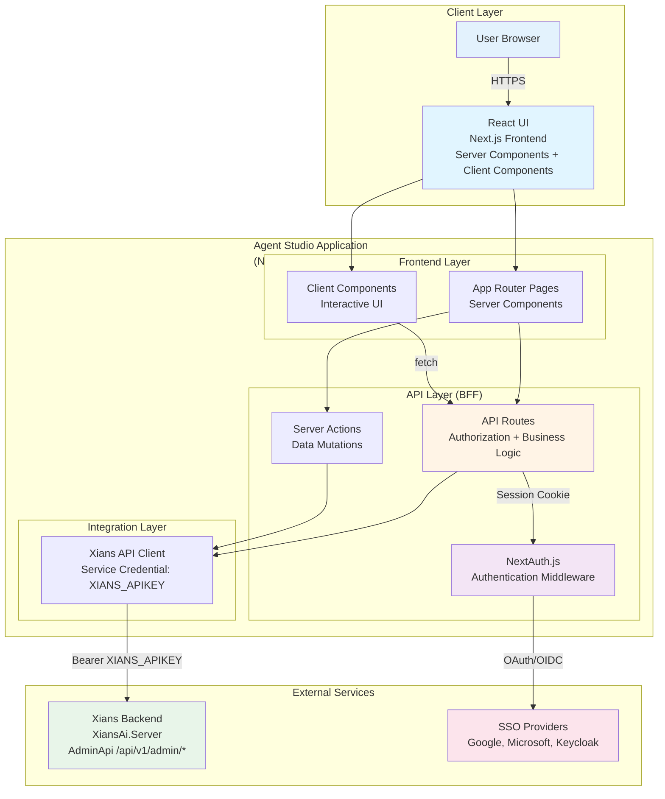
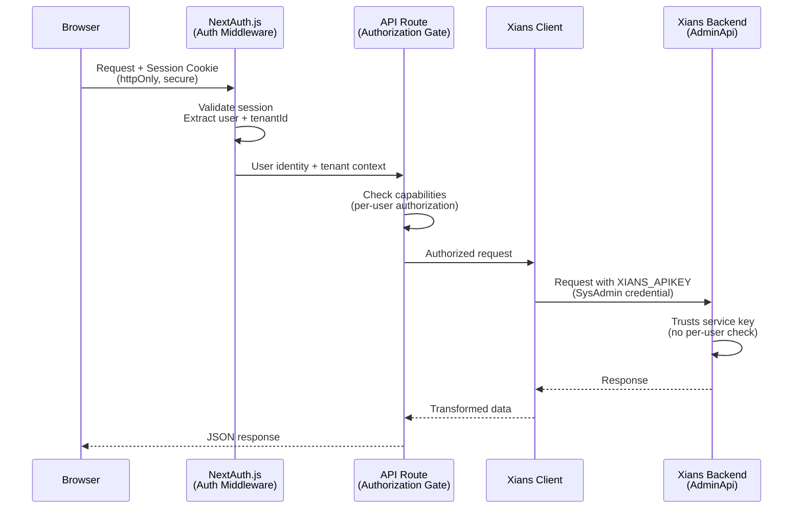
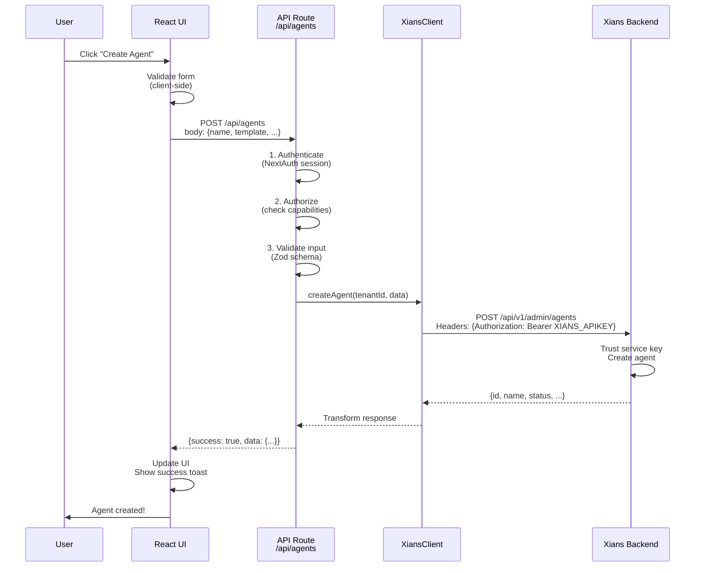
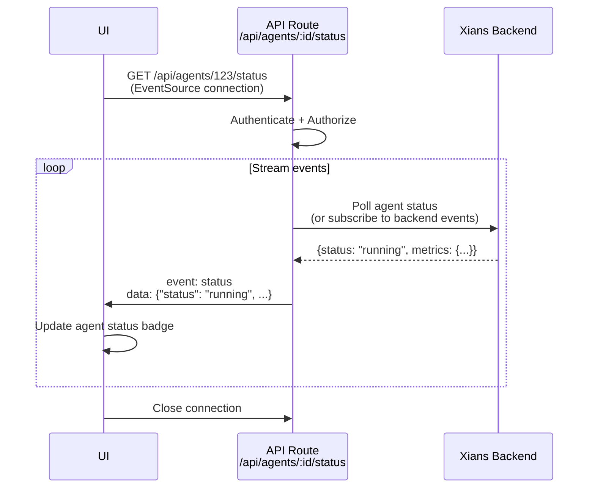
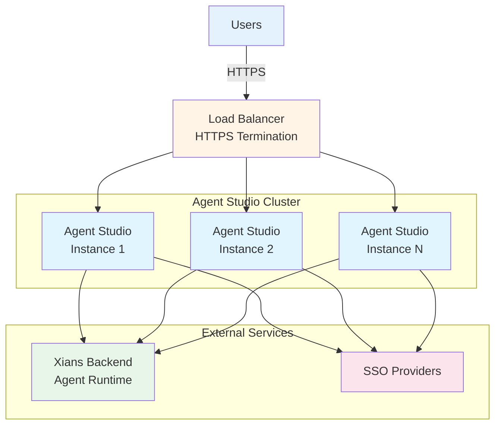

# System Architecture Overview

**Version:** 1.0  
**Last Updated:** 2026-07-16  
**Status:** Active

---

## Table of Contents

1. [Introduction](#introduction)
2. [High-Level Architecture](#high-level-architecture)
3. [Backend-for-Frontend (BFF) Pattern](#backend-for-frontend-bff-pattern)
4. [Component Architecture](#component-architecture)
5. [Data Flow](#data-flow)
6. [External Service Integration](#external-service-integration)
7. [Real-Time Communication](#real-time-communication)
8. [Deployment Architecture](#deployment-architecture)
9. [Key Technical Decisions](#key-technical-decisions)

**Related Documents:**
- **[Multi-Tenancy Architecture](./MULTI_TENANCY.md)** - Tenant isolation model
- **[Data Model](./DATA_MODEL.md)** - Entity relationships
- **[API Contract](./API_CONTRACT.md)** - REST API specification
- **[Security Architecture](./SECURITY_ARCHITECTURE.md)** - Security controls
- **[Authorization Model](../auth/authorization-model.md)** - BFF trust model details

---

## Introduction

Agent Studio is a **Next.js-based frontend application** that serves as a comprehensive interface for building, managing, and monitoring AI agents. The architecture follows a **Backend-for-Frontend (BFF)** pattern where the Next.js application acts as a trusted intermediary between users and the Xians backend platform.

### Key Architectural Characteristics

- **Platform:** Next.js 14+ with App Router (React Server Components)
- **Pattern:** Backend-for-Frontend (BFF) with Next.js API routes
- **Security Model:** Trust boundary at API layer, single service credential to backend
- **Multi-Tenancy:** Complete tenant isolation at all layers
- **Real-Time:** Server-Sent Events (SSE) for streaming
- **Deployment:** Docker containers, cloud-native

---

## High-Level Architecture



### Architecture Layers

| Layer | Responsibility | Technology |
|-------|---------------|------------|
| **Client Layer** | User interface, interactivity, visual presentation | React, Next.js Server/Client Components, Tailwind CSS |
| **Frontend Layer** | Server-side rendering, data fetching, initial page load | Next.js App Router, React Server Components |
| **API Layer (BFF)** | Authorization, tenant isolation, business logic, API aggregation | Next.js API Routes, Server Actions |
| **Integration Layer** | External service communication, data transformation | Xians API Client, HTTP client |
| **External Services** | Agent runtime, data persistence, authentication providers | Xians Backend, OAuth/OIDC providers |

---

## Backend-for-Frontend (BFF) Pattern

Agent Studio implements a **Backend-for-Frontend (BFF)** pattern where the Next.js application serves as a trusted intermediary between the browser and external services.

> **Critical Security Principle:** The browser **never** communicates directly with the Xians backend. All requests flow through Next.js API routes, which act as the sole authorization boundary.

### Trust Boundary



### Why BFF?

**Security Benefits:**
- **Single authorization point:** All user permission checks happen in Next.js API routes
- **Credential isolation:** Service credentials (XIANS_APIKEY) never exposed to browser
- **Defense in depth:** Multiple layers between user and sensitive operations
- **Audit trail:** All API calls logged at the BFF layer

**Development Benefits:**
- **API aggregation:** Combine multiple backend calls into single frontend request
- **Data transformation:** Shape backend responses for optimal frontend consumption
- **Simplified frontend:** Frontend doesn't handle authentication headers or retry logic
- **Parallel development:** Frontend and backend can evolve independently

**Operational Benefits:**
- **Rate limiting:** Control API usage at BFF layer
- **Caching:** Cache responses to reduce backend load
- **Error handling:** Graceful degradation and user-friendly error messages
- **Monitoring:** Single point for observability

### Service Credential Model

```
XIANS_APIKEY = SysAdmin-level service credential
├── Created by: SysAdmin user on Xians platform
├── Scope: Cross-tenant, platform-wide access
├── Used by: Next.js API routes only (server-side)
└── Authorization: Backend trusts the key, not the end user
```

**Critical Security Invariant:**
> If a Next.js API route forgets to check user authorization, it exposes admin-level operations to any authenticated user. **Every route must validate** `session.user` and `capabilities` before calling Xians APIs.

See [../auth/authorization-model.md](../auth/authorization-model.md) for complete details.

---

## Component Architecture

### Frontend Component Hierarchy

```
app/
├── layout.tsx                          # Root layout (theme provider, auth provider)
├── (auth)/                             # Auth route group (no app shell)
│   ├── login/page.tsx                 # Login page (Client Component)
│   └── layout.tsx                     # Auth layout (minimal)
│
├── (dashboard)/                        # Main app route group (with shell)
│   ├── layout.tsx                     # Dashboard layout (Header + Sidebar + Main)
│   ├── page.tsx                       # Dashboard home (Server Component)
│   ├── tasks/                         # Tasks module
│   │   ├── page.tsx                  # Task list (Server Component)
│   │   └── [id]/page.tsx             # Task detail (Server Component)
│   ├── agents/                        # Agents module
│   ├── conversations/                 # Conversations module
│   ├── templates/                     # Templates module
│   ├── knowledge/                     # Knowledge module
│   ├── performance/                   # Performance module
│   └── settings/                      # Settings module
│
└── api/                               # API routes (BFF layer)
    ├── auth/[...nextauth]/route.ts   # NextAuth.js endpoints
    ├── agents/                        # Agent API routes
    │   ├── route.ts                  # GET /api/agents, POST /api/agents
    │   └── [id]/                     
    │       ├── route.ts              # GET/PATCH/DELETE /api/agents/:id
    │       └── status/route.ts       # SSE /api/agents/:id/status
    ├── tasks/                         # Task API routes
    ├── conversations/                 # Conversation API routes
    │   └── [id]/stream/route.ts      # SSE /api/conversations/:id/stream
    └── knowledge/                     # Knowledge API routes
```

### Component Types

**Server Components (Default):**
- Data fetching from API routes
- Initial page rendering
- SEO-friendly content
- Reduced client bundle size
- Examples: Page layouts, static content, data tables

**Client Components (`'use client'`):**
- Interactive elements (buttons, forms, modals)
- Browser APIs (localStorage, window, etc.)
- React hooks (useState, useEffect, custom hooks)
- Event handlers
- Examples: Forms, sidebars, modals, real-time components

**Server Actions:**
- Form submissions
- Data mutations (create, update, delete)
- Progressive enhancement (works without JavaScript)
- Examples: Create agent, update task status, delete knowledge

### State Management

```
State Management Architecture:
│
├── Server State (React Server Components)
│   ├── Fetched on server during render
│   ├── Passed as props to Client Components
│   └── Refetched via router.refresh() or revalidation
│
├── Client State (React Hooks)
│   ├── Local UI state (useState)
│   ├── Side effects (useEffect)
│   └── Custom hooks (useSession, useCapabilities)
│
└── Global State (Zustand)
    ├── User session (authenticated user, current tenant)
    ├── UI preferences (sidebar collapsed, theme)
    └── Real-time updates (agent status, new tasks)
```

**State Management Rules:**
1. **Server Components first:** Fetch data on server when possible
2. **Client state minimal:** Only for interactivity and browser APIs
3. **Global state sparingly:** Only for cross-component shared state
4. **No prop drilling:** Use context or Zustand for deeply nested state

---

## Data Flow

### Request Flow: User Action → API → Backend



### Response Flow: Real-Time Updates (SSE)



### Data Transformation Pipeline

```
Backend Response → API Route → Frontend State
│
├── 1. API Route receives raw backend response
├── 2. Transform: snake_case → camelCase
├── 3. Filter: Remove internal fields
├── 4. Augment: Add computed fields
├── 5. Validate: Runtime type check (Zod)
└── 6. Return: Frontend-optimized shape
```

**Example Transformation:**

```typescript
// Backend response
{
  agent_id: "agt_123",
  display_name: "Support Agent",
  created_at: "2026-07-16T10:00:00Z",
  _internal_field: "value"
}

// Transformed for frontend
{
  id: "agt_123",
  name: "Support Agent",
  createdAt: "2026-07-16T10:00:00Z",
  // _internal_field removed
}
```

---

## External Service Integration

### Xians Backend Integration

**Xians Platform (XiansAi.Server)** provides:
- Agent runtime and execution
- Data persistence (agents, tasks, conversations, knowledge)
- Business logic and workflows
- User and tenant management
- Metrics and analytics

**Integration Pattern:**

```typescript
// lib/api/xians-client.ts
export class XiansClient {
  private baseUrl: string;
  private apiKey: string;  // XIANS_APIKEY (SysAdmin credential)
  
  async getAgents(tenantId: string): Promise<Agent[]> {
    const response = await fetch(
      `${this.baseUrl}/api/v1/admin/agents?tenantId=${tenantId}`,
      {
        headers: {
          'Authorization': `Bearer ${this.apiKey}`,
          'Content-Type': 'application/json',
        },
      }
    );
    
    if (!response.ok) {
      throw new XiansAPIError(response.status, await response.text());
    }
    
    return response.json();
  }
}

// app/api/agents/route.ts
export async function GET(request: Request) {
  const session = await getServerSession(authOptions);
  if (!session?.user?.tenantId) {
    return NextResponse.json({ error: 'Unauthorized' }, { status: 401 });
  }
  
  // Authorization check (BFF responsibility)
  const capabilities = await getCapabilities(session.user);
  if (!capabilities.has('agents:list')) {
    return NextResponse.json({ error: 'Forbidden' }, { status: 403 });
  }
  
  // Call backend with service credential
  const client = new XiansClient(
    process.env.XIANS_SERVER_URL!,
    process.env.XIANS_APIKEY!
  );
  
  const agents = await client.getAgents(session.user.tenantId);
  
  return NextResponse.json({ success: true, data: agents });
}
```

### SSO Provider Integration

**Supported Providers:**
- Google OAuth 2.0
- Microsoft Azure AD / Entra ID
- Keycloak (OIDC)

**Integration via NextAuth.js:**

```typescript
// app/api/auth/[...nextauth]/route.ts
export const authOptions: AuthOptions = {
  providers: [
    GoogleProvider({
      clientId: process.env.GOOGLE_CLIENT_ID!,
      clientSecret: process.env.GOOGLE_CLIENT_SECRET!,
    }),
    // ... other providers
  ],
  callbacks: {
    async signIn({ user, account, profile }) {
      // Fetch user's tenants and roles from Xians backend
      const participant = await getParticipantTenants(user.email);
      return !!participant;  // Deny if user not found
    },
    async jwt({ token, user }) {
      // Enrich JWT with tenant and role info
      if (user) {
        const participant = await getParticipantTenants(user.email);
        token.tenantId = participant.defaultTenantId;
        token.tenants = participant.tenants;
        token.capabilities = resolveCapabilities(participant.roles);
      }
      return token;
    },
  },
};
```

See [../auth/MULTI_PROVIDER_SSO_SETUP.md](../auth/MULTI_PROVIDER_SSO_SETUP.md) for complete setup.

---

## Real-Time Communication

### Architecture: SSE + REST

Agent Studio uses **Server-Sent Events (SSE)** for server-to-client streaming and **REST API** for client-to-server requests.

**Why SSE over WebSockets:**
- Simpler protocol (HTTP-based)
- Perfect for one-way streaming (agent responses, status updates)
- Automatic reconnection in browsers
- Firewall and proxy friendly
- Lower overhead for read-heavy workloads

**When to Use Each:**

| Pattern | Use Case | Protocol |
|---------|----------|----------|
| **SSE** | Streaming agent responses token-by-token | `EventSource` API |
| **SSE** | Live agent status updates | `EventSource` API |
| **SSE** | Real-time notifications | `EventSource` API |
| **REST** | Send messages to agent | `POST /api/conversations/:id/messages` |
| **REST** | CRUD operations | Standard HTTP methods |

**SSE Implementation Pattern:**

```typescript
// Server: app/api/conversations/[id]/stream/route.ts
export async function GET(
  request: Request,
  { params }: { params: { id: string } }
) {
  const session = await getServerSession(authOptions);
  // ... authorization checks ...
  
  const encoder = new TextEncoder();
  const stream = new TransformStream();
  const writer = stream.writable.getWriter();
  
  // Stream agent responses
  const response = await xiansClient.streamConversation(
    session.user.tenantId,
    params.id
  );
  
  for await (const chunk of response) {
    await writer.write(
      encoder.encode(`event: message\ndata: ${JSON.stringify(chunk)}\n\n`)
    );
  }
  
  await writer.close();
  
  return new Response(stream.readable, {
    headers: {
      'Content-Type': 'text/event-stream',
      'Cache-Control': 'no-cache',
      'Connection': 'keep-alive',
    },
  });
}

// Client: components/conversation/message-stream.tsx
'use client';

export function MessageStream({ conversationId }: Props) {
  useEffect(() => {
    const eventSource = new EventSource(
      `/api/conversations/${conversationId}/stream`
    );
    
    eventSource.addEventListener('message', (event) => {
      const chunk = JSON.parse(event.data);
      setMessages(prev => [...prev, chunk]);
    });
    
    eventSource.addEventListener('error', () => {
      eventSource.close();
    });
    
    return () => eventSource.close();
  }, [conversationId]);
  
  return <div>{/* render messages */}</div>;
}
```

See [../implementation-notes/SSE_REAL_TIME_MESSAGING.md](../implementation-notes/SSE_REAL_TIME_MESSAGING.md) for complete implementation details.

---

## Deployment Architecture

### Container Architecture

```
┌─────────────────────────────────────────────┐
│         Agent Studio Container              │
│                                             │
│  ┌─────────────────────────────────────┐  │
│  │   Next.js Application                │  │
│  │   (Node.js 18+ Runtime)             │  │
│  │                                      │  │
│  │   Port: 3010                        │  │
│  │   Health: /api/health               │  │
│  └─────────────────────────────────────┘  │
│                                             │
│  Environment:                               │
│  - NEXTAUTH_SECRET                          │
│  - NEXTAUTH_URL                             │
│  - XIANS_SERVER_URL                         │
│  - XIANS_APIKEY (SysAdmin)                  │
│  - GOOGLE_CLIENT_ID/SECRET                  │
│  - ... (see deployment docs)                │
└─────────────────────────────────────────────┘
         │
         ↓
    Port 3010 → Load Balancer → HTTPS
```

### Production Topology



**Scaling Characteristics:**
- **Stateless:** No session storage in containers (sessions in httpOnly cookies signed by NEXTAUTH_SECRET)
- **Horizontal scaling:** Add more instances behind load balancer
- **Health checks:** `/api/health` endpoint for liveness probes
- **Zero-downtime deployment:** Rolling updates supported

See [../deploy/README.md](../deploy/README.md) for deployment guides.

---

## Key Technical Decisions

### 1. Next.js App Router (vs Pages Router)

**Decision:** Use Next.js 14+ App Router with React Server Components

**Rationale:**
- **Performance:** Reduced client bundle, server-side data fetching
- **Developer experience:** Colocation of data fetching and UI
- **Future-proof:** Modern React paradigm, official recommendation
- **SEO:** Better support for streaming and progressive enhancement

**Trade-offs:**
- Learning curve for team
- Some libraries not yet Server Component compatible
- More complex mental model (server vs client boundary)

### 2. BFF Pattern (vs Direct Backend Calls)

**Decision:** Next.js API routes as Backend-for-Frontend, not direct client-to-Xians calls

**Rationale:**
- **Security:** Single authorization boundary, credential isolation
- **Flexibility:** Can aggregate multiple backend calls
- **Simplicity:** Frontend doesn't manage auth headers or retry logic
- **Monitoring:** Single observability point

**Trade-offs:**
- Extra network hop (client → Next.js → Xians)
- More code to maintain (API route layer)
- Potential latency impact (mitigated by server-side rendering)

### 3. SSE (vs WebSockets)

**Decision:** Server-Sent Events for real-time streaming

**Rationale:**
- **Simplicity:** HTTP-based, no protocol upgrade needed
- **Use case fit:** One-way streaming (server → client)
- **Auto-reconnect:** Built into EventSource API
- **Infrastructure:** Works through most proxies and firewalls

**Trade-offs:**
- No bidirectional communication (use REST for client → server)
- Browser limits on concurrent connections (6 per domain)
- Less efficient for high-frequency bidirectional updates

### 4. Phased Backend (Dummy → External)

**Decision:** Start with dummy JSON data, migrate to Xians backend in Phase 2

**Rationale:**
- **Parallel development:** Frontend team unblocked
- **Fast iteration:** No external dependencies during development
- **Easy migration:** Swap implementation without changing API contract
- **Testing:** Predictable dummy data for testing

**Trade-offs:**
- Maintain two implementations temporarily
- Risk of API contract drift if not careful
- Extra testing effort when transitioning

See [../technology.md#phased-implementation-strategy](../technology.md#phased-implementation-strategy).

### 5. shadcn/ui (vs Component Library)

**Decision:** Use shadcn/ui (copy-paste components) instead of npm-installed library

**Rationale:**
- **Code ownership:** Full control over component code
- **Customization:** Easy to modify for Nordic design system
- **No lock-in:** Not tied to library release cycle
- **Bundle size:** Only include components actually used

**Trade-offs:**
- No automatic updates (must manually copy new versions)
- More code to maintain
- Less "batteries included" than full UI library

See [../theme.md#component-library-decision](../theme.md#component-library-decision).

---

## Summary

Agent Studio's architecture prioritizes **security**, **developer experience**, and **scalability** through:

1. **BFF Pattern:** Trust boundary at API layer with single service credential
2. **Multi-Tenancy:** Complete isolation at all layers
3. **Server Components:** Reduced client bundle, improved performance
4. **Type Safety:** TypeScript + Zod throughout the stack
5. **Real-Time:** SSE for streaming, REST for mutations
6. **Deployment:** Stateless containers, horizontal scaling

For detailed information on specific aspects:
- Multi-tenant isolation → [MULTI_TENANCY.md](./MULTI_TENANCY.md)
- Data models and schemas → [DATA_MODEL.md](./DATA_MODEL.md)
- API endpoints and contracts → [API_CONTRACT.md](./API_CONTRACT.md)
- Security controls → [SECURITY_ARCHITECTURE.md](./SECURITY_ARCHITECTURE.md)
- Authorization details → [../auth/authorization-model.md](../auth/authorization-model.md)

---

**Maintained By:** Development Team  
**Review Schedule:** Quarterly or after major architectural changes  
**Questions?** See [README.md](./README.md) for navigation and getting started guides
